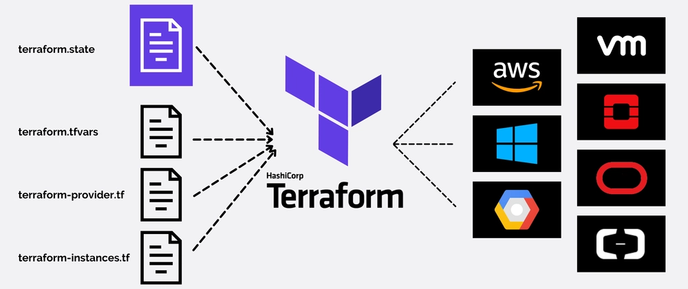
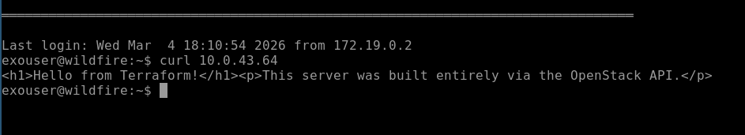

::: {.callout-note collapse="false"}
## readme.txt — The Objective

-   Today, we'll manage some VMs without using the Exosphere UI.\
-   Managing one server via a web UI is easy; managing fifty is a nightmare.
-   One way to handle scale and complexity is by treating cloud infrastructure as software.
-   In this lab, you will generate a programmatic API key, explore the OpenStack CLI, and use Terraform to build a functional web server entirely from code before permanently destroying it.
:::

::: {.callout-important collapse="false"}
## caveat.txt — WARNING

We all share the same OpenStack project.. With great power comes great responsibility. Be careful, and do not delete infrastructure that does not belong to you!

{fig-align="center"}
:::

------------------------------------------------------------------------

## Part 1: The Theory (Imperative vs. Declarative)

Before we write code, we must understand the two primary ways to interact with a cloud API programmatically.

### 1. The OpenStack CLI (Imperative)

-   The Command Line Interface is **Imperative**.
-   You are giving the cloud direct, sequential commands (e.g., "Delete server X," "List all volumes," "Attach security group Y").
-   It is excellent for quick tasks or writing bash loops to fix 30 servers at once.

<!-- -->

-   **The Syntax:** It follows a strict `noun` + `verb` structure.
-   **Example:** `openstack server list` or `openstack volume create`

### 2. Terraform (Declarative)

-   Terraform is **Declarative**.
-   Instead of giving sequential commands, you write a blueprint (a "state") of exactly what you want the world to look like. 
- Terraform calculates the difference between reality and your blueprint, and makes the necessary API calls to make reality match your code.
-   **The Syntax:** Terraform uses HashiCorp Configuration Language (HCL). It relies on distinct `blocks`.
-   **Example:**

```         
resource "openstack_compute_instance_v2" "my_server" {    
   # Configuration goes here
}
```

#### **The Safety Net (`terraform plan`):**

-   Because Terraform is declarative, you'll usually run `terraform plan` before applying so you can double check teh execution plan.
-   It will print a detailed list of exactly what it intends to create, modify, or destroy, ensuring you don't accidentally nuke the data center.

{fig-align="center"}

------------------------------------------------------------------------

## Part 2: The Multi-Cloud

-   You might be wondering: *Why learn HashiCorp Configuration Language (HCL) just for Jetstream2?*
-   The answer is that Terraform is a multi-cloud tool.
-   The developer, HashiCorp acts as a universal translator. They have written "Providers" (plugins) for almost every API on earth: OpenStack, Google Cloud (GCP), Amazon (AWS), Azure, GitHub, and even Spotify.
-   While the specific *nouns* change depending on the cloud provider, the *grammar* and the *workflow* (`terraform plan` $\rightarrow$ `terraform apply`) are identical everywhere.

::: {.callout-tip collapse="false"}
## rosetta_stone.sys — OpenStack vs. Google Cloud Platform

Look at how similar it is to provision a server in Jetstream2 (OpenStack) versus Google Cloud. The structure is identical; only the specific vocabulary changes to match the provider's API.

**The Jetstream2 (OpenStack) Server:**

``` hcl
resource "openstack_compute_instance_v2" "demo" {
  name            = "my-server"
  image_name      = "Featured-Ubuntu22"    
  flavor_name     = "m3.small"             
  network {
    name = "auto_allocated_network"        
  }
}
```

**The Google Cloud (GCP) Server:**

``` hcl
resource "google_compute_instance" "demo" {
  name         = "my-server"
  machine_type = "e2-micro"                
  zone         = "us-central1-a"           

  boot_disk {
    initialize_params {
      image = "debian-cloud/debian-11"     
    }
  }
  network_interface {
    network = "default"                    
  }
}
```

> **Takeaway:** If you can write Terraform for Jetstream2 today, you already know how to provision enterprise infrastructure at a Fortune 500 company running on GCP or AWS tomorrow. You just have to look up the provider's specific dictionary.
:::

------------------------------------------------------------------------

## Part 3: The Keys to the Data Center

To use the OpenStack CLI and Terraform we need to generate proper credentials. This is our "Robot Password."

::: {.callout-warning collapse="false"}
## auth_gen.exe — Creating an Application Credential

1.  Log into the raw OpenStack web interface [**Horizon**](https://js2.jetstream-cloud.org) using your standard login.
2.  On the left sidebar, navigate to **Identity** $\rightarrow$ **Application Credentials**.
3.  Click **Create Application Credential**.
4.  Name it `lab6-cli-key`.
5.  **CRITICAL:** Check the box that says **Unrestricted**. (This allows Terraform to build networks).
6.  Nothing else needs to be filled out.
7.  Click Create, then immediately click **Download openrc file**.
8.  Save this `.sh` file to your lab folder.
:::

------------------------------------------------------------------------

## Part 4: Installing the Tools & Testing the Pulse

To control the cloud, your laptop needs the right command-line utilities.

::: {.callout-tip collapse="false"}
## setup.bat — Local Installations

**1. The OpenStack CLI (via `uv`)**

-   We will use `uv` to install the OpenStack client.
-   Because we are using the `tool` command, `uv` will automatically create a safe, isolated environment in the background and link the command to your terminal. You do not need to run `uv init` or be in a specific folder.

Open your terminal and run:

``` bash
uv tool install python-openstackclient
```

*Verify it works by typing `openstack --version`.*

**2. Terraform**

-   Terraform is a standalone binary. Instead of downloading it manually, we will use your system's package manager to install it directly from HashiCorp's official repositories.

**For Mac users (using Homebrew):**

``` bash
brew tap hashicorp/tap
brew install hashicorp/tap/terraform
```

**For Linux & Windows WSL users (Ubuntu/Debian):**

-   Run these commands one by one to add the HashiCorp repository and install Terraform:

``` bash
sudo apt-get update && sudo apt-get install -y software-properties-common gnupg curl

curl -fsSL https://apt.releases.hashicorp.com/gpg | sudo gpg --dearmor -o /usr/share/keyrings/hashicorp-archive-keyring.gpg

echo "deb [arch=$(dpkg --print-architecture) signed-by=/usr/share/keyrings/hashicorp-archive-keyring.gpg] https://apt.releases.hashicorp.com $(lsb_release -cs) main" | sudo tee /etc/apt/sources.list.d/hashicorp.list

sudo apt-get update && sudo apt-get install terraform
```

**For Windows users:**

If you use the Chocolatey package manger simply do:

``` powershell
choco install terraform
```

Otherwise you'll need to download and install a binary and add Terraform to your path.

*Verify your installation works by typing `terraform -version`.*
:::

::: {.callout-important collapse="false"}
## terminal.sys — The Pulse Check

Now that the tools are installed, let's load your API credentials into your terminal session so your laptop can authenticate with Jetstream2.

**For Mac and Native Linux Users:**

-   Open your terminal, navigate to the folder where you saved your credential file, and run:

``` bash
source lab6-cli-key-openrc.sh
```

**For Windows Users:**

-   The `.sh` file is a Linux script, so it will not work natively in the standard Command Prompt or PowerShell.

> *Pro-Tip: I highly recommend installing the **Windows Subsystem for Linux (WSL)** if you are not already!*

If you are not using WSL currently, you have two fallback options:

1.  **(Git Bash):** Open the **Git Bash** terminal (installed with Git for Windows). Navigate to the file and run `source lab6-cli-key-openrc.sh`.
2.  **(PowerShell):** Open the `.sh` file in Notepad. You will see a list of `export` commands. You must manually translate them into PowerShell environment variables in your terminal like this:

``` powershell
$env:OS_APPLICATION_CREDENTIAL_ID="paste_your_id_here"
$env:OS_APPLICATION_CREDENTIAL_SECRET="paste_your_secret_here"
# Repeat for the other 5 variables in the file...
```

**The Test:** Now, ask the Jetstream2 API for a list of all servers currently running in our project:

``` bash
openstack server list
```

You should see a massive ASCII table displaying your personal server, my servers, and your classmates' servers! 
:::

------------------------------------------------------------------------

## Part 5: Functional Infrastructure as Code

-   We are going to write a Terraform blueprint that tells OpenStack to build a brand new server.
-   But we won't stop there. We will pass a `cloud-init` script via the `user_data` field.
-   This tells the cloud to automatically install `nginx` and write a custom webpage as soon as the server turns on.

1.  Create a file called `main.tf` in a new `lab6` directory.
2.  Paste the following code.

> **Note:** You MUST change the `name` field to include your initials or come up with a unique name!

``` hcl
terraform {
  required_providers {
    openstack = {
      source = "terraform-provider-openstack/openstack"
    }
  }
}

provider "openstack" {}

# Create a functional web server
resource "openstack_compute_instance_v2" "lab_server" {
  name            = "YOUR_INITIALS-terraform-web"   # CHANGE THIS!
  image_name      = "Featured-Ubuntu22"    
  flavor_name     = "m3.small"             
  security_groups = ["cloud_group"]
  network {
    name = "auto_allocated_network"        
  }

  # This bash script runs automatically on first boot as root
  user_data = <<-EOF
              #!/bin/bash
              apt-get update -y
              apt-get install -y nginx
              echo "<h1>Hello from Terraform!</h1><p>This server was built entirely via the OpenStack API.</p>" > /var/www/html/index.html
              systemctl restart nginx
              EOF
}

# Output the internal IP address when finished
output "server_ip" {
  value = openstack_compute_instance_v2.lab_server.access_ip_v4
}
```

::: {.callout-note collapse="false"}
## deploy.exe — Build, Test, and Destroy

Run the following commands in order:

1.  `terraform init` *(Downloads the OpenStack plugins)*
2.  `terraform plan` *(Review the blueprint. It should say "1 to add")*
3.  `terraform apply` *(Type 'yes' when prompted. Watch the server build!)*

**The Test:** Terraform will output an internal IP address (e.g., `10.0.0.X`). Because we didn't attach a public IP, you cannot view this in your laptop's browser. Instead, open the Exosphere Web Shell for your exsting VM in Exosphere and run: `curl <THAT_INTERNAL_IP>`

**Did you get a "Connection Refused" error? Don't panic!**

This illustrates the difference between infrastructure provisioning ersus configuration:

-   **Provisioning (Terraform):** Terraform's only job is to ask OpenStack for virtual hardware. The exact millisecond OpenStack allocates the CPU and assigns the IP address, Terraform declares success and exits. This is incredibly fast (\~10 seconds).
-   **Configuration (`cloud-init`):** However, inside the server, the Ubuntu operating system is still booting up. Your `user_data` script is quietly running in the background, updating packages, installing Nginx, and writing your HTML file. This can take more like 60 to 90 seconds.
- If you run `curl` before Nginx finishes installing, the server's firewall instantly drops the connection. Take a breath, wait a minute or two, and try the command again. You should eventually see the raw HTML output of your custom Nginx page!

 

**The Cleanup:** Do not leave this server running.

4.  `terraform destroy` *(Type 'yes' to permanently delete the server and save our SU allocation).*
:::

::: {.callout-note collapse="false"}
## routing.sys — Why did that work?

-   You just used the `curl` command to download a webpage from your new Terraform server, but you used an IP address that started with `10.x.x.x`.
-   Try putting that exact same IP address into your laptop's web browser. **It will fail.** Why?
-   Because that IP address is completely invisible to the public internet.
-   When you built your own VM in Exosphere, it was attached to our project's internal router (the `auto_allocated_network`), and we explicitly gave it a **Floating IP** (a public address) so your laptop could reach it.
-   When your Terraform script built this new server, it attached it to that *exact same internal network*, but it **did not** request a Floating IP.

**The Microservices Paradigm:**

-   When you ran that `curl` command from another VM on JS2, the traffic never left the JS2 data center. It traveled directly across the internal virtual switch from one machine to the other.
-   In a production setting, your database servers and backend APIs will **never** have public IP addresses.
-   They will live on private subnets. Hackers cannot port-scan a server they cannot route to. Only your public-facing web servers are allowed to talk to them over the internal network.
:::

------------------------------------------------------------------------

## Part 6: Deliverables

::: {.callout-note collapse="false"}
## submission.zip — What to turn in

**Required Submission:** Upload a single screenshot to the course assignments page showing your Exosphere Web Shell (or SSH terminal). The screenshot must clearly show: 

1. The execution of the `curl <YOUR_INTERNAL_IP>` command. 
2. The successful HTML output (`<h1>Hello from Terraform!</h1>...`).
:::