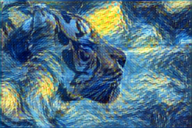

::: {.callout-note collapse="false"}
## readme.txt — Lab Objectives

In this lab, you will build a complete, two-part cloud architecture for an image processing pipeline:

1.  **Cloud Run (The AI Microservice):** You will package a lightweight Machine Learning model into a Docker container to create an API that applies the style of a famous painting to any uploaded photo.
2.  **Cloud Run Functions (The Event Worker):** You will write an invisible background worker that automatically wakes up whenever a new image is uploaded to a storage bucket, resizes it into a thumbnail, and saves it.

**Core Concept:** You will learn that deploying an AI workload is fundamentally different from deploying a standard web server. You will have to tune your container's memory, operating system, and web server software to handle the intense resource demands of Machine Learning.
:::

------------------------------------------------------------------------

## Phase 1: The AI Art API (Cloud Run)

Machine Learning models often require specific system-level C++ libraries to run efficiently. Because App Engine does not let us install OS-level packages, we must deploy this AI microservice using a Docker container on Cloud Run.

### Step 1: Download the Pre-Trained Model

We are going to use a quantized OpenCV model pre-trained on Vincent van Gogh's *Starry Night*.

-   Create a new folder on your computer called `art-api`, open your terminal inside that folder, and run this command to download the 15MB weights file directly from Stanford University:

::: panel-tabset
## Mac / Linux / Cloud Shell

``` bash
curl -LO http://cs.stanford.edu/people/jcjohns/fast-neural-style/models/eccv16/starry_night.t7
```

## Windows (PowerShell)

*(Note: We use `curl.exe` explicitly in PowerShell to avoid alias conflicts with `Invoke-WebRequest`).*

``` powershell
curl -LO http://cs.stanford.edu/people/jcjohns/fast-neural-style/models/eccv16/starry_night.t7
```
:::

### Step 2: The Dependencies and Dockerfile

-   Inside your `art-api` folder, create your `requirements.txt` and `Dockerfile`.

**`requirements.txt`**

``` text
Flask==3.0.0
gunicorn==21.2.0
opencv-python-headless==4.9.0.80
numpy==1.26.4
```

::: {.callout-important collapse="false"}
## ML vs. Web Server — OS Pinning

-   For a simple Python web server, we can usually just use the newest version of Linux.
-   However, OpenCV strictly requires underlying Linux C++ libraries to handle heavy image matrices. Notice we are specifically pinning Debian 11 "Bullseye" and manually installing the `libglib2.0-0` system package to ensure our ML model has the graphics engines it needs to run.
:::

**`Dockerfile`**

``` dockerfile
FROM python:3.11-slim-bullseye

# Install necessary C++ system libraries for OpenCV
RUN apt-get update && apt-get install -y libglib2.0-0

WORKDIR /app
COPY requirements.txt .
RUN pip install --no-cache-dir -r requirements.txt

# Copy our code and our ML model into the container
COPY main.py .
COPY starry_night.t7 .

# Tune Gunicorn specifically for an ML workload
CMD ["gunicorn", "--bind", "0.0.0.0:8080", "--timeout", "120", "--workers", "1", "--threads", "8", "main:app"]
```

::: {.callout-important collapse="false"}
## ML vs. Web Server — Tuning Gunicorn

-   Look at the `CMD` line above. By default, Gunicorn is optimized for lightweight websites.
-   It expects responses in under 30 seconds and spins up multiple "workers" (copies of your app) to handle traffic.
-   **The default behavior can cause your container to crash.** - Loading a neural network into memory takes time (hence `--timeout 120`). If Gunicorn tries to spin up 3 workers, they will all try to load the $\approx$ 25MB model into RAM simultaneously, causing a memory spike.
-   We use `--workers 1` to force it to load the model only once, and use lightweight `--threads 8` to handle concurrent users safely.
:::

### Step 3: The Python API

Create a `main.py` file. This script handles both the complex AI matrix manipulation and the Flask web routing to process incoming user requests.

``` python
from flask import Flask, request, send_file
import cv2
import numpy as np
import io

app = Flask(__name__)

# Load the ML model into memory when the container starts
net = cv2.dnn.readNetFromTorch('starry_night.t7')

def apply_style(image_bytes):
    """The heavy-lifting ML function."""
    # Convert raw bytes to an OpenCV matrix
    np_img = np.frombuffer(image_bytes, np.uint8)
    img = cv2.imdecode(np_img, cv2.IMREAD_COLOR)
    
    # Resize and format for the Neural Network
    (h, w) = img.shape[:2]
    blob = cv2.dnn.blobFromImage(img, 1.0, (w, h), (103.939, 116.779, 123.680), swapRB=False, crop=False)
    
    # Run the AI Inference
    net.setInput(blob)
    output = net.forward()
    
    # Reshape the output back into a standard image
    output = output.reshape((3, output.shape[2], output.shape[3]))
    output[0] += 103.939
    output[1] += 116.779
    output[2] += 123.680
    output /= 255.0
    output = output.transpose(1, 2, 0)
    output = np.clip(output * 255.0, 0, 255).astype(np.uint8)
    
    # Convert back to a PNG byte stream
    _, buffer = cv2.imencode('.png', output)
    return io.BytesIO(buffer)

@app.route('/stylize', methods=['POST'])
def stylize():
    # 1. Check if the user actually attached a file named 'image'
    if 'image' not in request.files:
        return "No image provided", 400
        
    # 2. Extract the file from the request
    file = request.files['image']
    image_bytes = file.read()
    
    # 3. Pass the bytes to our ML function
    stylized_io = apply_style(image_bytes)
    
    # 4. Return the new image to the user's browser
    return send_file(stylized_io, mimetype='image/png')

if __name__ == '__main__':
    app.run(host='0.0.0.0', port=8080)
```

### Step 4: Build and Deploy

::: {.callout-important collapse="false"}
## ML vs. Web Server — Preventing OOM Crashes

-   By default, Google Cloud Run gives new containers 512MB of RAM.
-   This is plenty for a simple web server. However, decoding a high-resolution JPEG and passing it through a Neural Network will easily spike past that, causing Google to instantly kill your container with an Out-Of-Memory (OOM) error.
-   Notice in the deployment command below, we explicitly allocate `--memory=2Gi` to give the AI room to breathe.
:::

Execute the following commands in your terminal to build the container in the cloud and deploy it as a public API. *(Make sure to replace `[YOUR_PROJECT_ID]` with your actual project ID).*

::: panel-tabset
## Mac / Linux / Cloud Shell

``` bash
# 1. Enable APIs and create the Artifact Registry
gcloud services enable run.googleapis.com artifactregistry.googleapis.com cloudbuild.googleapis.com

gcloud artifacts repositories create ai-repo \
    --repository-format=docker \
    --location=us-west1 \
    --description="Docker repository for AI containers"

# 2. Build the Docker image via Cloud Build
gcloud builds submit --tag us-west1-docker.pkg.dev/[YOUR_PROJECT_ID]/ai-repo/art-api:latest

# 3. Deploy to Cloud Run (With 2GB of RAM!)
gcloud run deploy art-api-service \
    --image=us-west1-docker.pkg.dev/[YOUR_PROJECT_ID]/ai-repo/art-api:latest \
    --allow-unauthenticated \
    --region=us-west1 \
    --memory=2Gi \
    --port=8080
```

## Windows (PowerShell)

``` powershell
# 1. Enable APIs and create the Artifact Registry
gcloud services enable run.googleapis.com artifactregistry.googleapis.com cloudbuild.googleapis.com

gcloud artifacts repositories create ai-repo `
    --repository-format=docker `
    --location=us-west1 `
    --description="Docker repository for AI containers"

# 2. Build the Docker image via Cloud Build
gcloud builds submit --tag us-west1-docker.pkg.dev/[YOUR_PROJECT_ID]/ai-repo/art-api:latest

# 3. Deploy to Cloud Run (With 2GB of RAM!)
gcloud run deploy art-api-service `
    --image=us-west1-docker.pkg.dev/[YOUR_PROJECT_ID]/ai-repo/art-api:latest `
    --allow-unauthenticated `
    --region=us-west1 `
    --memory=2Gi `
    --port=8080
```
:::

:::: {.callout-tip collapse="false"}
## Testing Your API

-   Once deployed, Cloud Run will print a public URL.
-   Find a moderately sized `.jpg` photo on your computer (try to avoid 20-megapixel raw files) and test your API from your terminal. *(Ensure the photo is in your current terminal directory!)*

::: panel-tabset
## Mac / Linux / Cloud Shell

``` bash
curl -X POST https://[YOUR-CLOUD-RUN-URL].a.run.app/stylize \
     -F "image=@my_photo.jpg" \
     --output starry_photo.png
```

## Windows (PowerShell)

``` powershell
curl.exe -X POST https://[YOUR-CLOUD-RUN-URL].a.run.app/stylize `
     -F "image=@my_photo.jpg" `
     --output starry_photo.png
```
:::

*Open `starry_photo.png` to see your AI-generated art!*

{fig-align="center"}
::::

------------------------------------------------------------------------

## Phase 2: The Auto-Thumbnailer (Cloud Run Functions)

Websites rarely serve the massive, full-resolution images users upload. They use event-driven background workers to generate smaller thumbnails to save bandwidth.

### Step 1: Create the Buckets

Create two Cloud Storage buckets in your project to act as our "Input" and "Output" folders. *(Remember: Bucket names must be globally unique!)*

``` bash
gcloud storage buckets create gs://[YOUR-LASTNAME]-raw-images --location=us-west1
gcloud storage buckets create gs://[YOUR-LASTNAME]-thumbnails --location=us-west1
```

### Step 2: The Dependencies and Function Logic

Create a new folder called `thumbnail-worker`.

**`requirements.txt`**

``` text
functions-framework==3.5.0
google-cloud-storage==2.14.0
Pillow==10.2.0
```

-   This script parses the incoming Google Cloud event, downloads the image, resizes it using the `Pillow` library, and uploads it to the destination bucket.

**`main.py`**

``` python
import functions_framework
from google.cloud import storage
from PIL import Image
import io

storage_client = storage.Client()

# IMPORTANT: Replace this with your actual destination bucket name!
DESTINATION_BUCKET = "[YOUR-LASTNAME]-thumbnails"

@functions_framework.cloud_event
def generate_thumbnail(cloud_event):
    # Extract the bucket and filename from the event payload
    payload = cloud_event.data
    source_bucket_name = payload["bucket"]
    file_name = payload["name"]
    
    print(f"Detected new image: {file_name} in {source_bucket_name}")
    
    # 1. Download the image from the source bucket into memory
    source_bucket = storage_client.bucket(source_bucket_name)
    blob = source_bucket.blob(file_name)
    image_bytes = blob.download_as_bytes()
    
    # 2. Resize the image using Pillow
    img = Image.open(io.BytesIO(image_bytes))
    img.thumbnail((200, 200)) # Scale down while keeping aspect ratio
    
    # 3. Save the thumbnail to a byte stream
    thumb_io = io.BytesIO()
    img.convert('RGB').save(thumb_io, format='JPEG') # Save as JPEG to keep it small
    
    # 4. Upload the new thumbnail to the destination bucket
    dest_bucket = storage_client.bucket(DESTINATION_BUCKET)
    new_blob_name = f"thumb_{file_name}"
    dest_blob = dest_bucket.blob(new_blob_name)
    
    dest_blob.upload_from_string(thumb_io.getvalue(), content_type='image/jpeg')
    print(f"Successfully generated thumbnail: {new_blob_name}")
```

### Step 3: Deploy and Test

::: {.callout-warning collapse="false"}
## security.sys — IAM Permissions

-   Because Cloud Storage needs to trigger our function, we must grant its background service account permission to publish Pub/Sub messages!
-   Eventarc relies on Pub/Sub to pass the "file uploaded" alert to your function.
:::

Execute these commands to grant the necessary permissions and deploy your function.

::: panel-tabset
## Mac / Linux / Cloud Shell

``` bash
# 1. Fetch your unique Project Number
PROJECT_NUMBER=$(gcloud projects describe [YOUR_PROJECT_ID] --format="value(projectNumber)")

# 2. Grant Cloud Storage permission to trigger functions
gcloud projects add-iam-policy-binding [YOUR_PROJECT_ID] \
    --member="serviceAccount:service-$PROJECT_NUMBER@gs-project-accounts.iam.gserviceaccount.com" \
    --role="roles/pubsub.publisher"

# 3. Deploy the Function
gcloud functions deploy thumbnail-processor \
    --gen2 \
    --runtime=python312 \
    --region=us-west1 \
    --source=. \
    --entry-point=generate_thumbnail \
    --trigger-bucket=[YOUR-LASTNAME]-raw-images
```

## Windows (PowerShell)

``` powershell
# 1. Fetch your unique Project Number
$PROJECT_NUMBER = gcloud projects describe [YOUR_PROJECT_ID] --format="value(projectNumber)"

# 2. Grant Cloud Storage permission to trigger functions
gcloud projects add-iam-policy-binding [YOUR_PROJECT_ID] `
    --member="serviceAccount:service-$PROJECT_NUMBER@gs-project-accounts.iam.gserviceaccount.com" `
    --role="roles/pubsub.publisher"

# 3. Deploy the Function
gcloud functions deploy thumbnail-processor `
    --gen2 `
    --runtime=python312 `
    --region=us-west1 `
    --source=. `
    --entry-point=generate_thumbnail `
    --trigger-bucket=[YOUR-LASTNAME]-raw-images
```
:::

::: {.callout-tip collapse="false"}
## Testing the Pipeline

1.  Once deployed, upload any image into your `raw-images` bucket using the Cloud Console web interface or the CLI.
2.  Wait about 5 seconds, then check your `thumbnails` bucket. Your scaled-down image should magically appear!
:::

------------------------------------------------------------------------

## Phase 3: Cleanup & Submission

**Submission Requirements (Proof of Completion):** To receive full credit for this lab, you must submit the following items to the course portal:

2.  **Terminal Output:** Submit a screenshot of your terminal showing the successful deployment output of your `gcloud run deploy` command.
3.  **The AI Result:** Submit the actual `starry_photo.png` image you successfully generated via your Cloud Run container.
4.  **The Pipeline Proof:** Submit a screenshot of your Google Cloud Console (Cloud Storage bucket view) clearly showing the `thumb_` file inside your output bucket, proving your event-driven background worker successfully executed.

::: {.callout-important collapse="false"}
## destroy.exe — Teardown

If you leave these services running, you will continue to drain your class credits. Execute the following `gcloud` commands to delete your infrastructure.
:::

``` bash
# 1. Delete the Cloud Run Container Service & Artifact Registry
gcloud run services delete art-api-service --region=us-west1 --quiet
gcloud artifacts repositories delete ai-repo --location=us-west1 --quiet

# 2. Delete the Cloud Run Function
gcloud functions delete thumbnail-processor --region=us-west1 --quiet

# 3. Delete BOTH Cloud Storage Buckets (and their contents)
gcloud storage rm --recursive gs://[YOUR-LASTNAME]-raw-images
gcloud storage rm --recursive gs://[YOUR-LASTNAME]-thumbnails
```