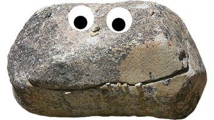

## Lab Objective

-   In this lab, you will build an app to log finds of rare, valuable, or just cool rocks and minerals.
-   The app will store images of your finds in a private **Cloud Storage** bucket and link them to structured, searchable "Field Notes" in a serverless **Firestore** database.

::: {.callout-important collapse="false"}
## Lab Constraints

-   **Zero Public Access:** Your storage bucket must remain entirely private.
-   Access to photos is granted strictly via time-limited **Signed URLs**.
-   **Nested Schema:** Your Firestore documents must utilize nested maps to store location data.
-   **Environment Isolation:** You must use a named Firestore database (`geology-vault`) rather than relying on the project's default database.
:::

------------------------------------------------------------------------

## Part 1: Provisioning the Infrastructure

### 1.1 The Secure Asset Bucket

Create a standard regional bucket in `us-west1`. This will hold the photos of our rock / mineral finds.


::: panel-tabset
## Mac / Linux / Cloud Shell

``` bash
gcloud storage buckets create gs://[YOUR-PROJECT]-specimen-vault --location=us-west1
```

## Windows (PowerShell)

``` powershell
gcloud storage buckets create gs://[YOUR-PROJECT]-specimen-vault --location=us-west1
```

:::


- You may upload any image you'd like to this bucket as `default.jpg`.
- I used this one:



### 1.2 The Named Database

Initialize a new Firestore database in Native mode specifically for this lab.

::: panel-tabset
## Mac / Linux / Cloud Shell

``` bash
gcloud firestore databases create --database="geology-vault" --location=nam5 --type=firestore-native
```

## Windows (PowerShell)

``` powershell
gcloud firestore databases create --database="geology-vault" --location=nam5 --type=firestore-native
```
:::

------------------------------------------------------------------------

## Part 2: Manual Schema Design

-   Before we deploy the application, we need to establish our NoSQL schema. While Firestore is fast and loose with schemas, it's good practice to plan out how your data will be represented.\
-   You will manually log your first specimen to understand the document structure. (For example, let's log a pale blue Sapphire found out near Rock Creek).

1.  Navigate to **Firestore -\> Databases -\> geology-vault** in the Cloud Console.
2.  Click **+ Start Collection** and set the Collection ID to `specimens`.
3.  Set the Document ID to `sapphire_001`.
4.  Add the flat fields:
    -   Name: `mineral_type` \| Type: `string` \| Value: `Sapphire`
    -   Name: `notes` \| Type: `string` \| Value: `Found near Rock Creek. High clarity, pale blue.`
    -   Name: `image_path` \| Type: `string` \| Value: `default.jpg`
5.  Click **+ Add field** to create our nested object:
    -   Name: `location` \| Type: `map`
6.  Inside the new `location` map, add the nested fields:
    -   Name: `county` \| Type: `string` \| Value: `Granite`
    -   Name: `lat` \| Type: `double` \| Value: `46.7`
    -   Name: `lng` \| Type: `double` \| Value: `-113.7`
7.  Click **Save**.

------------------------------------------------------------------------

## Part 3: IAM Security Configuration

For our App Engine code to successfully write to the database, upload photos, and mathematically sign secure URLs, its Service Account needs the correct IAM "ID Badges."

::: panel-tabset
## Mac / Linux / Cloud Shell

``` bash
PROJECT_ID=$(gcloud config get-value project)
SA_EMAIL="$PROJECT_ID@appspot.gserviceaccount.com"

# 1. Enable the IAM Credentials API (Required for Signed URLs)
gcloud services enable iamcredentials.googleapis.com

# 2. Allow App Engine to sign URLs
gcloud projects add-iam-policy-binding $PROJECT_ID \
    --member="serviceAccount:$SA_EMAIL" \
    --role="roles/iam.serviceAccountTokenCreator"

# 3. Allow App Engine to read/write to the private bucket
gcloud storage buckets add-iam-policy-binding gs://[YOUR-PROJECT]-specimen-vault \
    --member="serviceAccount:$SA_EMAIL" \
    --role="roles/storage.objectAdmin"
```

## Windows (PowerShell)

``` powershell
$PROJECT_ID = gcloud config get-value project
$SA_EMAIL = "$PROJECT_ID@appspot.gserviceaccount.com"

# 1. Enable the IAM Credentials API (Required for Signed URLs)
gcloud services enable iamcredentials.googleapis.com

# 2. Allow App Engine to sign URLs
gcloud projects add-iam-policy-binding $PROJECT_ID `
    --member="serviceAccount:$SA_EMAIL" `
    --role="roles/iam.serviceAccountTokenCreator"

# 3. Allow App Engine to read/write to the private bucket
gcloud storage buckets add-iam-policy-binding gs://[YOUR-PROJECT]-specimen-vault `
    --member="serviceAccount:$SA_EMAIL" `
    --role="roles/storage.objectAdmin"
```
:::

------------------------------------------------------------------------

## Part 4: The "Field Notes" App

Create a new directory for your lab and include the following three files.

**`requirements.txt`**

``` text
Flask==3.0.0
google-cloud-storage==2.14.0
google-cloud-firestore==2.14.0
google-auth==2.23.3
requests==2.31.0
```

**`app.yaml`**

``` yaml
runtime: python311
service: cloud-data-lab

# Protect your student credits!
automatic_scaling:
  max_instances: 1
```

**`main.py`** This application handles listing existing specimens, parsing multipart form uploads to GCS, creating nested Firestore documents, and generating cryptographic Signed URLs.

``` python
import os, uuid
from flask import Flask, render_template_string, request, redirect
from google.cloud import storage, firestore
from google.cloud.firestore_v1.base_query import FieldFilter
import google.auth
import google.auth.transport.requests

app = Flask(__name__)
PROJECT_ID = os.environ.get('GOOGLE_CLOUD_PROJECT')
BUCKET_NAME = f"{PROJECT_ID}-specimen-vault"

# Explicitly connect to our named environment!
db = firestore.Client(database="geology-vault")
storage_client = storage.Client()

@app.route('/')
def index():
    """Route: Query Firestore and display all logged specimens."""
    # Fetch all documents in the 'specimens' collection
    docs = db.collection("specimens").stream()
    
    specimens = []
    for doc in docs:
        data = doc.to_dict()
        data['id'] = doc.id # Save the document ID so we can link to it
        specimens.append(data)
    
    html = """
    <h1>Rockhound Vault</h1>
    <h3>Field Log</h3>
    <ul>
    
        <li>
            <strong>{{ s.mineral_type }}</strong> 
            (Found in: {{ s.location.county | default('Unknown') }} County) 
            - <a href="/specimen/{{ s.id }}">View Details</a>
        </li>
    
    </ul>
    
    <hr>
    <h3>Log New Specimen</h3>
    <form action="/add" method="post" enctype="multipart/form-data">
        <input type="text" name="mineral_type" placeholder="Mineral (e.g., Beryl)" required><br><br>
        <input type="text" name="county" placeholder="County (e.g., Missoula)" required><br><br>
        <textarea name="notes" placeholder="Field notes..."></textarea><br><br>
        <label>Upload Photo (Private GCS):</label><br>
        <input type="file" name="image" accept="image/*" required><br><br>
        <button type="submit">Upload to Vault</button>
    </form>
    """
    return render_template_string(html, specimens=specimens)

@app.route('/add', methods=['POST'])
def add_specimen():
    """Route: Handle file upload to GCS and structured metadata to Firestore."""
    mineral = request.form.get('mineral_type')
    county = request.form.get('county')
    notes = request.form.get('notes')
    image_file = request.files.get('image')
    
    # 1. Handle Unstructured Data (Cloud Storage)
    filename = "default.jpg"
    if image_file and image_file.filename != '':
        # Generate a random unique filename to prevent overwrites
        ext = image_file.filename.split('.')[-1]
        filename = f"{uuid.uuid4().hex}.{ext}"
        
        bucket = storage_client.bucket(BUCKET_NAME)
        blob = bucket.blob(filename)
        blob.upload_from_file(image_file)
        
    # 2. Handle Structured NoSQL Data (Firestore)
    # Notice how we build a nested Map for the location data!
    doc_ref = db.collection("specimens").document() # Auto-generates an ID
    doc_ref.set({
        "mineral_type": mineral,
        "notes": notes,
        "image_path": filename,
        "location": {
            "county": county,
            "lat": 0.0, # Placeholder for future GPS integration
            "lng": 0.0
        }
    })
    
    return redirect('/')

@app.route('/specimen/<doc_id>')
def view_specimen(doc_id):
    """Route: Retrieve nested Firestore data and generate a Signed URL for the photo."""
    doc = db.collection("specimens").document(doc_id).get()
    if not doc.exists:
        return "Specimen not found in Firestore", 404
        
    data = doc.to_dict()
    
    # Generate the Signed URL for the private image
    bucket = storage_client.bucket(BUCKET_NAME)
    blob = bucket.blob(data.get('image_path', 'default.jpg'))
    
    credentials, _ = google.auth.default()
    credentials.refresh(google.auth.transport.requests.Request())
    
    img_url = ""
    if blob.exists():
        img_url = blob.generate_signed_url(
            version="v4",
            expiration=900, # URL expires in 15 minutes
            service_account_email=credentials.service_account_email or f"{PROJECT_ID}@appspot.gserviceaccount.com",
            access_token=credentials.token
        )

    html = """
    <h1>{{ data.mineral_type }}</h1>
    <p><strong>County:</strong> {{ data.location.county }}</p>
    <p><strong>Notes:</strong> {{ data.notes }}</p>
    
    
        
    
        <p><em>Image file not found in bucket.</em></p>
    
    <br><br>
    <a href="/">Back to Vault</a>
    """
    return render_template_string(html, data=data, img_url=img_url)

if __name__ == '__main__':
    app.run(host='0.0.0.0', port=8080)
```

::: {.callout-note collapse="false"}
## Code Breakdown: How the Signed URL Works
If the `view_specimen` routing logic looks a little confusing, here is exactly what is happening behind the scenes to keep your bucket private:

1. **`google.auth.default()`**: This asks App Engine, "Who am I?" It automatically grabs the Service Account's temporary ID badge (credentials).
2. **`credentials.refresh(...)`**: Because these badges are temporary for security reasons, we force a refresh to ensure we have a valid, active token right this second.
3. **`generate_signed_url(...)`**: Normally, this function expects a permanent "Private Key" file. Because Google doesn't store permanent keys on App Engine servers, we explicitly pass it our temporary `access_token` and `service_account_email`. It uses these to cryptographically sign a URL that acts as a VIP pass for the browser for exactly 900 seconds (15 minutes).
:::

### Deploying the App

Run your standard App Engine deployment command. Since we used a named service (`cloud-data-lab`), this will not overwrite any previous deployments on your default service.

::: panel-tabset
## Mac / Linux / Cloud Shell

``` bash
gcloud app deploy
```

## Windows (PowerShell)

``` powershell
gcloud app deploy
```
:::

------------------------------------------------------------------------

## Part 5: Extra Credit (Bonus Objective)

For optional extra credit, try extending the application's NoSQL capabilities by implementing a **Filter Route**.

**The Goal:** Add a new Flask route (e.g., `/county/<county_name>`) that only displays specimens found in a specific county.

**The Challenge:**

-   You will need to read the Firestore Python documentation to figure out how to write a `.where()` query that targets a *nested map field*.
-   *Hint:* Look up how to use `FieldFilter` to query dot-notation paths like `"location.county"`.
-   Modify your `index()` template to include links that point to your new filter route (e.g., `<a href="/county/Missoula">Show Missoula Finds</a>`).

------------------------------------------------------------------------

## Part 6: Submission & Teardown

### Lab Submission Requirements

To receive full credit for Lab 9, upload the following files to Canvas:

2.  **Dashboard Screenshot:** A screenshot of your homepage showing at least two different uploaded specimens.
3.  **Detail View Screenshot:** A screenshot of a specific specimen's page. The URL bar must be visible, and the image must be successfully loaded (proving your Signed URL logic is working).
4.  **Extra Credit (Optional):** If you completed the bonus objective, include a screenshot of your filtered county view and a snippet of your updated Python code showing the Firestore query.

### Infrastructure Teardown

Because Firestore and Cloud Storage are serverless, they do not incur a monthly "idle" fee. However, it is a best practice to clean up your environment to keep your App Engine dashboard organized.

::: panel-tabset
## Mac / Linux / Cloud Shell

``` bash
# Delete the App Engine Service
gcloud app services delete cloud-data-lab

# Delete the Firestore Database (if used)
gcloud firestore databases delete --database=geology-vault

# Delete the Bucket (and all images inside)
gcloud storage rm -r gs://[YOUR-PROJECT]-specimen-vault
```

## Windows (PowerShell)

``` powershell
# Delete the App Engine Service
gcloud app services delete cloud-data-lab

# Delete the Firestore Database (if used)
gcloud firestore databases delete --database=geology-vault

# Delete the Bucket (and all images inside)
gcloud storage rm -r gs://[YOUR-PROJECT]-specimen-vault
```
:::