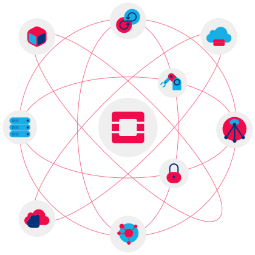
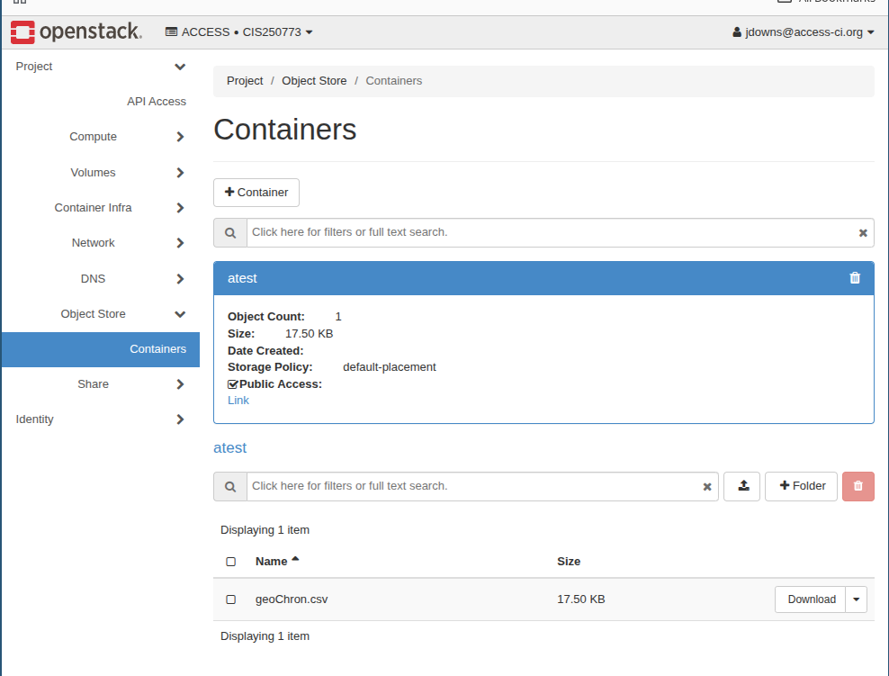

::: {.callout-note collapse="false"}
## readme.txt — Today's Objective

-   So far, we have been using **Exosphere** to build our servers.
-   Exosphere is Jetstream2's frontend UI that makes it incredibly easy to create new instances and handle common cloud computing tasks.\
-   Exosphere is simple, but limited. It doesn't unlock the full potential of Jetstream2.
-   Moreover, it makes opinionated, default choices for us behind the scenes that we might want to change.
-   Today, we will look at **OpenStack**, the massive open-source cloud operating system that powers Jetstream2.

{fig-align="center" width="334"}

-   We will compare it to commercial giants like AWS, explore the advanced architectural capabilities it unlocks, and run three live demonstrations that demonstrate some of the extended capabilities of Jetstream2 using OpenStack.
:::

------------------------------------------------------------------------

## Part 1: OpenStack vs. The Giants

-   Jetstream2 is an Infrastructure as a Service (IaaS) cloud built entirely on OpenStack.
-   While you will hear more about Amazon Web Services (AWS) or Google Cloud Platform (GCP) in industry, the underlying infrastructure is similar.
-   They simply use different brand names for the same core technologies.

::: {.callout-tip collapse="false"}
## rosetta_stone.dll — The Cloud Translation Guide

Openstack, AWS, and GCP have different names for similar technologies.

| Service Type | OpenStack (Jetstream2) | AWS | Google Cloud (GCP) |
|:-----------------|:-----------------|:-----------------|:-----------------|
| **Compute** (Virtual Machines) | **Nova** | EC2 | Compute Engine |
| **Block Storage** (Hard Drives/Volumes) | **Cinder** | EBS | Persistent Disk |
| **Networking** (Virtual Private Clouds) | **Neutron** | VPC | VPC Network |
| **Object Storage** (Infinite Data Lakes) | **Swift** | S3 | Cloud Storage |
| **Identity & Access** (Permissions) | **Keystone** | IAM | Cloud IAM |
:::

**The Core Differences:**

1.  **Philosophy:**

-   AWS is proprietary and commercialized (you pay per minute).
-   OpenStack is open-source and heavily used by research institutions (like the NSF), supercomputers, and telecom companies to build massive, private cloud environments.

2.  **Managed Services:**

-   AWS provides high-level "managed" tools (like click-to-deploy PostgreSQL databases or AI pipelines).
-   OpenStack gives you the raw infrastructure—if you want a database, you must build the VM and configure the software yourself.

> **Note:** OpenStack does not have all of the features of AWS or GCP. Additionally, unlike AWS or GCP, OpenStack is a software provider, and does not provide hardware.

------------------------------------------------------------------------

## Part 2: Beyond Exosphere (Broader Capabilities)

-   Using the **Horizon Dashboard** (OpenStack's raw web GUI) or the **OpenStack CLI**, opens up a wealth of more advanced features.
-   These include more technical, enterprise grade features like the ability to create private networks. 

::: {.callout-important collapse="false"}
## network.sys — Software-Defined Networking

In Exosphere, you click "Create Instance" and it magically gets an IP address. In raw OpenStack, you can use **Neutron** to build highly complex, secure network topologies entirely through software.

-   **Custom Private Subnets:** You can create dedicated networks for different parts of your application. For example, you can build subnet strictly for your web servers, and a separate subnet strictly for your databases.

-   **Isolated Environments:** You can create backend virtual machines that have no public internet access whatsoever. They cannot be reached by the outside world, making them virtually immune to external port-scanning bots.

-   **Inter-VM Communication:** Instead of routing traffic out to the internet and back, your web server VM can talk directly to your database VM over the internal, private OpenStack network.

## orchestration.exe — Advanced Fleet Management

Beyond just networking, OpenStack allows you to manage fleets of servers rather than single instances:

-   **Custom Images (Glance):** Instead of using a blank Ubuntu image every time, you can configure a server perfectly, take a "snapshot," and save it to OpenStack Glance. You can then boot 100 new servers using your custom snapshot.
-   **Load Balancing (Octavia):** You can spin up three identical web servers and place an OpenStack Load Balancer in front of them. It acts as a traffic cop, distributing incoming users across the three servers to prevent any single VM from crashing under heavy traffic.
:::

::: {.callout-note collapse="false"}
## topology.png — Network Topology


:::

::: {.callout-note collapse="false"}
## terminal.exe — Programmatic Cloud Control (The CLI)

-   Web dashboards are a great way to get started, but what happens when you need to manage 50 servers at once? Clicking through menus becomes impossible.

-   This introduces the **OpenStack Command Line Interface (CLI)**. By authenticating our local terminal with Jetstream2, we can interact with the cloud entirely through code.

-   **The Paradigm Shift:** 
- If a command can be typed, it can be scripted. Imagine you realize your default firewall rules are insecure and you need to apply a new Security Group to several different virtual machines (which actually happened in this class).
- In a web UI, that takes a lot of tedious clicking. With the OpenStack CLI, you can write a simple Bash loop:

``` bash
# Get all server IDs, loop through them, and apply the new firewall rule instantly
for server_id in $(openstack server list -c ID -f value); do
    openstack server add security group $server_id "cloud_group"
done
```

We won't be installing the CLI today, but understanding the idea that the cloud is just an API waiting to receive commands is the crucial stepping stone toward full DevOps automation.
:::

------------------------------------------------------------------------

## Part 3: A Few Demos

We are now going to bypass Exosphere entirely and interact directly with the Jetstream2 OpenStack APIs.

::: {.callout-warning collapse="false"}
## demo_1.bat — The Network Topology Visualizer

*When you click "Launch" in Exosphere, where does your server actually go?*

**The Demo:** We will navigate to the Horizon Dashboard's **Network Topology** tab to visualize our Virtual Private Cloud (VPC).

**What to watch for:**

-   Notice that your server is a specific node sitting inside a highly structured network.
-   You will see the "External Network" (the public internet), the Virtual Router acting as a gateway, and the private subnet where all of our class VMs safely live.
-   This visually explains why we must explicitly open firewall ports and assign "Floating IPs" to let the outside world in.
:::

::: {.callout-tip collapse="false"}
## demo_2.bat — The "Infinite Bucket" (Object Storage)

*What happens when your scientific dataset is too big for a standard volume?*

**The Demo:** We will use OpenStack **Swift** to create a public Object Storage container and upload a file to it.

**What to watch for:**

-   Notice we didn't have to create an instance to access this data or start a web server to serve it.
-   If you are processing terabytes of climate data, you can drop it into an Object Store where any computer in the world can fetch it via a simple HTTP link, completely decoupled from your compute instances.

{fig-align="center"}
:::

::: {.callout-important collapse="false"}
## demo_3.bat — "God Mode" (Terraform & Infrastructure as Code)

*How do real companies manage thousands of servers without clicking buttons in a dashboard all day?*

**The Demo:** We will use an orchestration tool called **Terraform**. I have written a small text file (`main.tf`) that describes a server, a network, and a security group. I will run the command `terraform apply` in my terminal.

``` hcl
# A snippet of our Terraform blueprint
resource "openstack_compute_instance_v2" "demo_server" {
  name            = "terraform-classroom-demo"
  image_name      = "Featured-Ubuntu22"    
  flavor_name     = "m3.small"             
  security_groups = ["default"]
  network {
    name = "auto_allocated_network"        
  }
}
```

**What to watch for:** Watch the Horizon dashboard as my terminal executes the code. The server will magically construct itself in seconds. Then, I will type `terraform destroy`, and the server will instantly be wiped from existence.

**The Lesson:** At scale, creating servers via UI is typically too slow, and humans make mistakes. Infrastructure is written as code, stored in Git, and deployed automatically.
:::