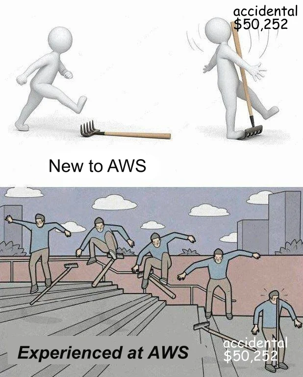
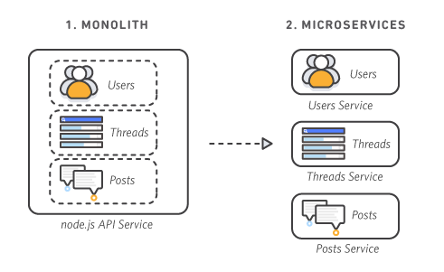
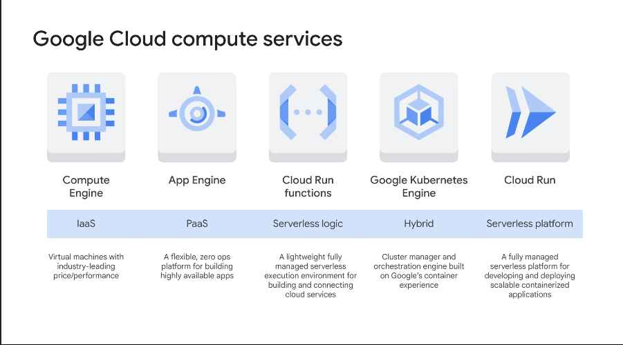
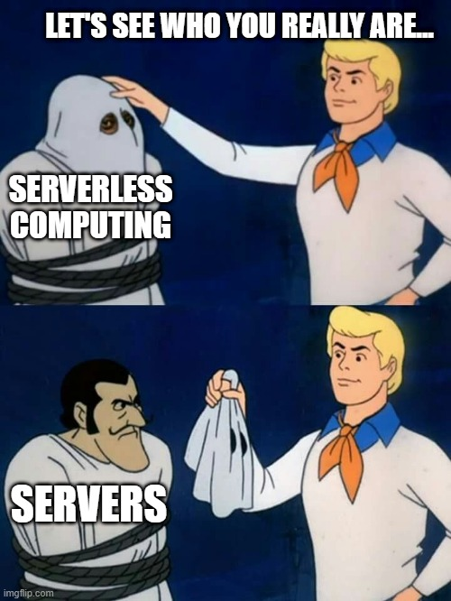
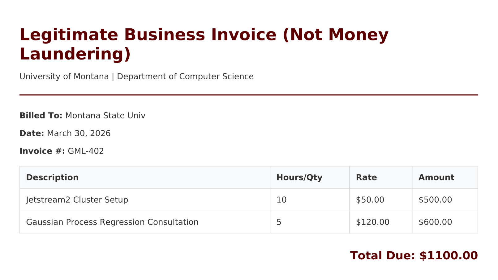

::: {.callout-note collapse="false"}
## readme.txt — Today's Objective

-   For midterm projects, we built our own infrastructure from scratch using OpenStack on Jetstream2. You learned the hard way how to provision virtual machines, manage subnets, and configure firewalls.
-   For the second half of the semester, we are migrating to the commercial **Google Cloud Platform (GCP)**.
-   Today, we will set up your Google Cloud Skills Boost accounts, discuss the reality of cloud economics, and walk through the "Compute Continuum" (the spectrum of services Google offers to run your code).
:::

------------------------------------------------------------------------

## Part 1: The Setup & The \$50 Reality Check

-   You will be completing your asynchronous homework using the **Google Cloud Skills Boost** platform. This platform spins up temporary, disposable Google Cloud environments for you to practice in safely.

-   However, for your final projects, you will be operating in a real, persistent GCP environment using \$50 in student credits.

    

::: {.callout-important collapse="false"}
## billing.exe — Cloud Economics

-   In Jetstream2, if you left a server running, it cost us "Service Units" (SUs).
-   In Google Cloud, if you leave a massive database running over the weekend, it drains actual dollars from your credit balance.
-   For this class, the main risk is draining your \$50 credit balance too quickly.

**The Golden Rules of Commercial Cloud:**

1.  **Turn it off:** If you are not actively using a resource, destroy it.
2.  **Budgets & Alerts:** The very first thing you do in a new GCP project is set up a Billing Alert. We will configure an alert to email you the moment you spend \$10, \$25, and \$40 of your credits so you are never caught off guard.
:::

## Part 2: The Resource Hierarchy (Escaping the Shared Sandbox)

-   In the first half of this semester, we worked in OpenStack.
-   Organization and permissions structures mostly worked via the *Don't touch an instance you didn't create* rule.
-   That was because everyone in the class was dumped into a single OpenStack tenant with equal permissions.
-   It was a shared sandbox where anyone could accidentally delete anyone else's work.

> Enterprise cloud environments do not operate on the honor system. Google Cloud solves this using a strict **Resource Hierarchy** and **Identity and Access Management (IAM)**.

### The Four Levels of Organization

When you work for a real company, you won't just have a standalone account. Your work will be governed by a top-down structure:

1.  **The Organization Node:** The absolute root of the company (e.g., `umontana.edu` or `netflix.com`). The central IT department controls this.
2.  **Folders:** Used to isolate departments or environments. A company might have a `Data Science` folder and a `Web Development` folder. Inside `Web Development`, they might have sub-folders for `Production` and `Testing`.
3.  **Projects:** The core trust boundary. **A Project is not just a workspace; it is a billing and security container.** Every single resource (VM, database, function) *must* belong to exactly one project.
4.  **Resources:** The actual compute services you spin up (e.g., a Compute Engine VM or a Cloud Storage bucket).

{fig-align="center"}

### How Companies Manage Personnel (IAM)

-   Google Cloud uses IAM (Identity and Access Management) to answer one question: *Who can do what on which resource?*
-   Permissions cascade downwards.
-   If the IT department grants you "Compute Admin" rights at the `Web Development` Folder level, you automatically inherit the ability to spin up virtual machines in *every* Project inside that folder.

::: {.callout-important collapse="false"}
## security.sys — The Principle of Least Privilege

Unlike our OpenStack classroom, in a real GCP environment, you will almost never be granted "Owner" access. Companies adhere to the **Principle of Least Privilege**.

If your job is to upload daily images to a storage bucket, the cloud architect will not give you access to the whole Project. They will assign your user account a highly specific role (e.g., `roles/storage.objectCreator`) applied *only* to that specific bucket. You won't even be able to view the virtual machines running right next door.
:::

------------------------------------------------------------------------

## Part 3: The Interfaces (How we control GCP)

Google provides three primary ways to interact with its cloud APIs. You will use all three in your upcoming labs.

1.  **The Cloud Console (GUI):** The web dashboard. It is pretty, but inefficient for some tasks.
2.  **Cloud Shell:** A temporary, free, browser-based Linux terminal provided by Google. It already has all the tools (`gcloud`, `terraform`, `git`) pre-installed.
3.  **The `gcloud` CLI (Local):** Similar to the OpenStack CLI. This is how you orchestrate massive deployments directly from your own laptop.

------------------------------------------------------------------------

## Part 4: The `gcloud` Quick Start Cheat Sheet

-   Before we build anything, you need to know how to navigate the CLI.
-   Similarly to the OpenStack CLI, the `gcloud` tool uses a strict `noun` + `verb` hierarchy (e.g., `gcloud compute instances list`).
-   The following cheat sheet may be handy for your labs.

::: {.callout-tip collapse="false"}
## cheat_sheet.txt — Essential Commands

| **Authentication & Configuration** | Command |
|:-----------------------------------|:-----------------------------------|
| `gcloud auth login` | Opens a browser to authenticate your terminal with your Google account. |
| `gcloud projects list` | Lists all the GCP projects you currently have access to. |
| `gcloud config set project [ID]` | Tells the CLI which project you are currently working inside. |
| `gcloud config set compute/region [REGION]` | Sets your default data center region (e.g., `us-central1`) to save typing. |
| `gcloud config list` | Displays your currently active configuration (account, project, region). |

| **Discovery & Troubleshooting** | Command |
|:-----------------------------------|:-----------------------------------|
| `gcloud compute instances list` | Shows all currently running Virtual Machines in your project. |
| `gcloud help [command]` | The ultimate lifesaver. Displays the official manual for any command. (e.g., `gcloud help compute instances create`). |
:::

------------------------------------------------------------------------

## Part 5: Global Infrastructure (Regions vs. Zones)

Before we deploy any servers, we have to decide *where* they will physically live. "The Cloud" is just a marketing term for somebody else's highly secure data center.

Google divides its global physical infrastructure into two distinct concepts:

1.  **Regions:** Independent geographic areas around the world (e.g., `us-central1` in Iowa, `us-west1` in Oregon). Choosing the right region reduces latency for your users and ensures you comply with local data laws.
2.  **Zones:** Deployment areas within a region (e.g., `us-central1-a`, `us-central1-b`, `us-central1-c`). You can think of zones as physically separate buildings on the exact same campus. They have independent power, network, and cooling infrastructure. If Zone A loses power, Zone B stays online.

::: {.callout-tip collapse="false"}
## CLI Setup: Handling Regions & Zones

When using the `gcloud` CLI, the API needs to know exactly which physical building you want to use. If you don't tell it, your deployment will fail or pause to ask you.

**1. Set your defaults:** You can save yourself from typing the `--region` and `--zone` flags on every single command by telling your terminal what your defaults are:

``` bash
gcloud config set compute/region us-central1
gcloud config set compute/zone us-central1-a
```

**2. The "Resource Exhausted" Reality Check:** Sometimes, you might try to build a VM and get a `ZONE_RESOURCE_POOL_EXHAUSTED` error. This is a great reminder of physical reality: it means that specific data center building is temporarily out of the exact hardware you requested! The fix is simple: just explicitly append `--zone=us-central1-b` to your command to try the building next door.
:::

------------------------------------------------------------------------

## Part 6: The Compute Continuum (Deep Dive)

When you want to run code on GCP, you have to answer a crucial architectural question: *How much control do I need, and how much server maintenance am I willing to do?*

::: {.callout-note collapse="false"}
## firebase.dll — Wait, haven't we used this before?

-   Since you are already familiar with **Firebase**, you might be wondering how it fits into this massive GCP ecosystem.

-   Here is the secret: **Firebase *is* Google Cloud Platform!** Firebase is essentially a mobile and web developer-friendly "wrapper" around core GCP infrastructure.

    -   **Cloud Firestore** in Firebase? That is GCP's native Firestore database.
    -   **Cloud Functions** for Firebase? Those are the exact same GCP Cloud Run Functions we are learning about today.
    -   **Firebase Storage?** That is just a Google Cloud Storage bucket with simplified security rules.

-   When you use GCP directly, you are just taking the Firebase training wheels off to access the raw engine underneath!
:::

-   Google offers a spectrum of compute options ranging from bare-metal control to fully managed serverless execution. Let's walk through the four levels you will be testing in your labs.

------------------------------------------------------------------------

## Part 7: In-Class Walkthroughs & Use Cases

We are now going to deploy code across the compute continuum live. I will use the `gcloud` CLI to demonstrate how to interact with these services without using the web browser.

### Level 1: Compute Engine (IaaS)

Compute Engine is Google's Virtual Machine service. It is the exact equivalent of OpenStack Nova.

-   **The Reality:** You get a raw hard drive, an IP address, and an OS. You have total control, but you are the janitor. If Ubuntu needs a security patch, it is your responsibility.
-   **Realistic Use Case:** A legacy application that requires an outdated version of Windows, or a heavily customized database where you need to tune the Linux kernel parameters.

:::: {.callout-note collapse="false"}
## demo_1.sh — The Compute Engine Walkthrough

Let's spin up a fully functioning Nginx web server in one command and open the firewall. We explicitly define the `--zone` to ensure we hit a data center with high capacity.

*(Note: We use semicolons in the `startup-script` so we can flatten it into a single line. This prevents formatting errors across different operating systems!)*

::: panel-tabset
## Mac / Linux / Cloud Shell

``` bash
gcloud compute instances create classroom-vm \
    --machine-type=e2-micro \
    --image-family=ubuntu-2204-lts \
    --image-project=ubuntu-os-cloud \
    --tags=http-server \
    --zone=us-central1-a \
    --metadata=startup-script="#! /bin/bash; apt-get update; apt-get install -y nginx; echo '<h1>Hello from Compute Engine!</h1>' > /var/www/html/index.html"

gcloud compute firewall-rules create allow-http \
    --action=ALLOW \
    --rules=tcp:80 \
    --target-tags=http-server
```

## Windows (PowerShell)

``` powershell
gcloud compute instances create classroom-vm `
    --machine-type=e2-micro `
    --image-family=ubuntu-2204-lts `
    --image-project=ubuntu-os-cloud `
    --tags=http-server `
    --zone=us-central1-a `
    --metadata=startup-script="#! /bin/bash; apt-get update; apt-get install -y nginx; echo '<h1>Hello from Compute Engine!</h1>' > /var/www/html/index.html"

gcloud compute firewall-rules create allow-http `
    --action=ALLOW `
    --rules=tcp:80 `
    --target-tags=http-server
```
:::

| **Understanding the Flags:** | Flag |
|:-----------------------------------|:-----------------------------------|
| `--machine-type` | The specific hardware footprint (CPU/RAM). `e2-micro` is a tiny, cheap instance. |
| `--image-family` | Tells GCP to grab the latest, fully patched version of this OS family. |
| `--tags` | Applies a network tag to the VM, allowing us to easily link firewall rules to it. |
| `--zone` | Forces the API to build the server in a specific physical data center. |
| `--metadata=startup-script` | The exact equivalent of `user_data` in OpenStack/Terraform. Runs on first boot. |
| `--rules` | Specifies the protocol and port to open (e.g., `tcp:80` for standard web traffic). |
::::

::: {.callout-warning collapse="false"}
## gotcha.sys — Control Plane vs. Data Plane

When the command finishes, `gcloud` will print a URL starting with `https://www.googleapis.com/...` **Do not click it!** That is the internal Google Cloud REST API endpoint (the Control Plane). If you click it, your browser will return an `UNAUTHENTICATED` JSON error.

To see your actual Nginx website (the Data Plane), look at the terminal output for your **`EXTERNAL_IP`** and paste *that* into your web browser (e.g., `http://34.63.142.53`).
:::

### Level 2: App Engine (PaaS)

-   App Engine (Platform as a Service) is where you stop managing servers and start managing applications.

-   **The Reality:** You write your code, define your dependencies, and hand the folder to Google. Google provisions the hidden VMs, sets up the load balancer, installs the SSL certificates, and auto-scales the app dynamically based on web traffic.

-   **Supported Languages:** App Engine comes in two flavors:

    -   **Standard Environment:** Runs code in a highly locked-down, secure sandbox. It starts up instantly and can scale down to zero instances (costing \$0) when no one is visiting. It supports **Python, Java, Node.js, Go, PHP, and Ruby**.
    -   **Flexible Environment:** If you need a language not listed above (e.g., Rust or C#), Flexible spins up a Docker container behind the scenes. It gives you more freedom, but it cannot scale to zero and takes longer to boot.

::: {.callout-note collapse="false"}
## capabilities.exe

-   App Engine is designed to handle everything from a student's simple "Hello World" homework to massive, global architectures.
-   In fact, **Snapchat** launched and scaled its entire early infrastructure on App Engine.
-   It natively supports Microservices. You can deploy a Python API, a Node.js frontend, and a Go processing worker all within the same App Engine project, and Google will automatically route traffic securely between them.
-   It also supports "Traffic Splitting," allowing you to route exactly 5% of your users to a new version of your code for A/B testing.

{fig-align="center"}
:::

::: {.callout-note collapse="false"}
## demo_2.sh — The App Engine Walkthrough

To deploy to App Engine, you only need three text files in a folder. But before we deploy anything, we have to remember the golden rule of fresh GCP projects: **APIs are disabled by default.**

**1. Enable the Required APIs:**

``` bash
gcloud services enable appengine.googleapis.com
gcloud services enable cloudbuild.googleapis.com
```

**2. `requirements.txt`** (Tells Google's Cloud Build robots what libraries to install)

``` text
Flask==3.0.0
gunicorn==21.2.0
```

**3. `main.py`** (Your actual application logic)

``` python
from flask import Flask

# App Engine looks for an object named 'app' by default
app = Flask(__name__)

@app.route('/')
def hello():
    return """
    <h1>Hello from App Engine!</h1>
    <p>I didn't have to configure a single firewall rule to get this online.</p>
    """

if __name__ == '__main__':
    app.run(host='127.0.0.1', port=8080, debug=True)
```

**4. `app.yaml`** (The blueprint that configures the Google Cloud environment)

``` yaml
# We use the modern Python 3.12 Standard Environment
runtime: python312

# This is the exact terminal command Google will run to start our web server
entrypoint: gunicorn -b :$PORT main:app
```

**The Deployment Command:** Open your terminal in the folder containing those files and run:

``` bash
gcloud app deploy --quiet
```

*Google will upload your files, install Flask via Cloud Build, attach a public HTTPS URL, and start serving traffic.*
:::

::: {.callout-tip collapse="false"}
## The PaaS Bargain: Who Manages What?

When you choose App Engine over Compute Engine (VMs), you are entering into a "Shared Responsibility Model" with Google. Here is what that trade-off actually looks like:

| The Developer Manages (You) | Google Cloud Manages (The Platform) |
|:-----------------------------------|:-----------------------------------|
| **Application Code:** (`main.py`) | **The Operating System:** (Ubuntu/Debian updates) |
| **Dependencies:** (`requirements.txt`) | **Security Patches:** (Kernel & network vulnerabilities) |
| **Environment Config:** (`app.yaml`) | **Load Balancing:** (Distributing traffic globally) |
| **Database Schema/Queries** | **Auto-Scaling:** (Spinning up new servers if traffic spikes) |
| **Application Logic & Bugs** | **SSL Certificates:** (Generating & renewing HTTPS crypto) |

**The Takeaway:** You trade underlying infrastructure control for developer speed and simplicity.
:::



### Level 3: Cloud Run (Serverless Containers)

Cloud Run bridges the gap between the flexibility of containers and the ease of App Engine.

::: {.callout-important collapse="false"}
## buzzword.sys — The "Serverless" Misnomer

-   **Serverless does *not* mean there are no servers.**
-   Your code is still running on physical CPUs bolted into racks inside a massive Google data center. "Serverless" is simply a marketing term for an operational and billing model.
-   When an engineer says a service is serverless, they mean three specific things:

1.  **Invisible Infrastructure:** You cannot SSH into the server. You never see the operating system. You never install a security patch.
2.  **Scale-to-Zero:** If your application gets hit by a viral Reddit post, it automatically scales up to 1,000 instances. If everyone goes to sleep and traffic drops to zero, the infrastructure literally spins down to zero.
3.  **Micro-Billing:** You do not pay a flat monthly fee to rent a machine. You pay *by the millisecond* only for the exact compute time your code spends actively processing a request. If your app is idle, you pay \$0.00.

{fig-align="center"}
:::

**The Reality:**

-   You package your application into a Docker container. You give the container to Cloud Run.
-   It is fully serverless—it scales from zero to thousands of instances in seconds, and you only pay while a request is actively being processed.

**Realistic Use Case (The PDF Generator):**

-   You wrote a Python API that generates PDF invoices for customers. However, your Python code relies on a Linux system-level application called `wkhtmltopdf` to actually draw the PDF.
-   App Engine does not natively support this system-level dependency. You must use a Docker container so you can ship the exact Linux OS, the system dependencies, and your Python code all in one box.

:::::: {.callout-note collapse="false"}
## demo_3.sh — The Cloud Run Walkthrough

To deploy to Cloud Run, we have to go through a three-step pipeline: Create a Registry (storage for containers), Build the Container, and Deploy the Container.

**1. The Files (The Application & The Box)** Create a new folder and add the following three files.

**`requirements.txt`** (Our Python libraries)

``` text
Flask==3.0.0
gunicorn==21.2.0
pdfkit==1.0.0
```

**`main.py`** (Our Python API logic and HTML invoice template)

``` python
from flask import Flask, request, make_response, render_template_string
import pdfkit
import datetime

app = Flask(__name__)

HTML_TEMPLATE = """
<!DOCTYPE html>
<html>
<head>
    <style>
        body { font-family: 'Helvetica', sans-serif; padding: 40px; color: #333; }
        .header { border-bottom: 2px solid #5e0000; padding-bottom: 10px; margin-bottom: 30px; }
        .header h1 { margin: 0; color: #5e0000; }
        table { width: 100%; border-collapse: collapse; margin-top: 20px; }
        th, td { border: 1px solid #ddd; padding: 12px; text-align: left; }
        th { background-color: #f8f9fa; color: #333; }
        .total { text-align: right; font-size: 1.4em; font-weight: bold; margin-top: 30px; color: #5e0000; }
    </style>
</head>
<body>
    <div class="header">
        <h1>Legitimate Business Invoice (Not Money Laundering)</h1>
        <p>University of Montana | Department of Computer Science</p>
    </div>
    
    <div>
        <p><strong>Billed To:</strong> {{ customer_name }}</p>
        <p><strong>Date:</strong> {{ date }}</p>
        <p><strong>Invoice #:</strong> {{ invoice_id }}</p>
    </div>

    <table>
    <tr>
        <th>Description</th>
        <th>Hours/Qty</th>
        <th>Rate</th>
        <th>Amount</th>
    </tr>
    
    <tr>
        <td>{{ item.description }}</td>
        <td>{{ item.qty }}</td>
        <td>${{ "%.2f"|format(item.rate) }}</td>
        <td>${{ "%.2f"|format(item.qty * item.rate) }}</td>
    </tr>
    
</table>

    <div class="total">
        Total Due: ${{ "%.2f"|format(total) }}
    </div>
</body>
</html>
"""

@app.route('/generate-invoice', methods=['POST'])
def generate_invoice():
    data = request.json
    items = data.get('items', [])
    total = sum([item['qty'] * item['rate'] for item in items])
    
    rendered_html = render_template_string(
        HTML_TEMPLATE, 
        customer_name=data.get('customer_name', 'Walk-in Client'),
        date=datetime.date.today().strftime("%B %d, %Y"),
        invoice_id=data.get('invoice_id', 'INV-0000'),
        items=items,
        total=total
    )
    
    # Trigger the Linux binary to draw the PDF
    pdf_bytes = pdfkit.from_string(rendered_html, False)
    
    response = make_response(pdf_bytes)
    response.headers['Content-Type'] = 'application/pdf'
    response.headers['Content-Disposition'] = f'attachment; filename={data.get("invoice_id", "invoice")}.pdf'
    
    return response

if __name__ == '__main__':
    app.run(host='0.0.0.0', port=8080)
```

**`Dockerfile`** (The blueprint for our container)

``` dockerfile
# Start with a specific, stable Linux OS (Debian 11 "Bullseye") containing Python
FROM python:3.11-slim-bullseye

# The Crucial Step: Install the Linux system-level dependency!
RUN apt-get update && apt-get install -y wkhtmltopdf

# Set up our working directory
WORKDIR /app

# Copy our requirements and install them
COPY requirements.txt .
RUN pip install --no-cache-dir -r requirements.txt

# Copy our actual Python application
COPY main.py .

# Tell the container how to start the web server on port 8080
CMD ["gunicorn", "--bind", "0.0.0.0:8080", "main:app"]
```

**2. Enable APIs & Create the Artifact Registry** Before we can build our container, we need a secure locker to store it in. Google's container locker is called Artifact Registry.

::: panel-tabset
## Mac / Linux / Cloud Shell

``` bash
gcloud services enable run.googleapis.com artifactregistry.googleapis.com cloudbuild.googleapis.com

gcloud artifacts repositories create classroom-repo \
    --repository-format=docker \
    --location=us-west1 \
    --description="Docker repository for class containers"
```

## Windows (PowerShell)

``` powershell
gcloud services enable run.googleapis.com artifactregistry.googleapis.com cloudbuild.googleapis.com

gcloud artifacts repositories create classroom-repo `
    --repository-format=docker `
    --location=us-west1 `
    --description="Docker repository for class containers"
```
:::

**3. Build and Push (Using Cloud Build)**

This command takes our folder, uploads it to Google, builds the Docker container on a temporary cloud server, and pushes the finished image directly into our Artifact Registry locker.

``` bash
gcloud builds submit --tag us-west1-docker.pkg.dev/[YOUR_PROJECT_ID]/classroom-repo/pdf-api:latest
```

**4. Deploy to Cloud Run**

Now that our container is built and stored in the registry, deploying it is a single command.

::: panel-tabset
## Mac / Linux / Cloud Shell

``` bash
gcloud run deploy pdf-generator-app \
    --image=us-west1-docker.pkg.dev/[YOUR_PROJECT_ID]/classroom-repo/pdf-api:latest \
    --allow-unauthenticated \
    --region=us-west1 \
    --port=8080
```

## Windows (PowerShell)

``` powershell
gcloud run deploy pdf-generator-app `
    --image=us-central1-docker.pkg.dev/[YOUR_PROJECT_ID]/classroom-repo/pdf-api:latest `
    --allow-unauthenticated `
    --region=us-central1 `
    --port=8080
```
:::

| **Understanding the Flags:** | Flag |
|:-----------------------------------|:-----------------------------------|
| `--image` | The exact URI pointing to your compiled Docker container in the registry. |
| `--allow-unauthenticated` | Bypasses IAM security, making your web application public to the entire internet. |
| `--port` | Tells Cloud Run which port your container is listening on internally so it can route traffic correctly. |

**5. Test the Live API**

Once deployed, Cloud Run will provide a public URL. You can test your containerized API by sending it a JSON payload directly from your terminal. *(Make sure to replace `YOUR-CLOUD-RUN-URL` with your actual deployment URL!)*

::: panel-tabset
## Mac / Linux / Cloud Shell

``` bash
curl -X POST https://YOUR-CLOUD-RUN-URL.a.run.app/generate-invoice \
     -H "Content-Type: application/json" \
     -d '{
           "customer_name": "Montana State Univ", 
           "invoice_id": "GML-402", 
           "items": [
             {"description": "Jetstream2 Cluster Setup", "qty": 10, "rate": 50.00}, 
             {"description": "Gaussian Process Regression Consultation", "qty": 5, "rate": 120.00}
           ]
         }' \
     --output my_invoice.pdf
```

## Windows (PowerShell)

``` powershell
$body = @{
    customer_name = "Montana State Univ"
    invoice_id = "GML-402"
    items = @(
        @{description = "Jetstream2 Cluster Setup"; qty = 10; rate = 50.00},
        @{description = "Gaussian Process Regression Consultation"; qty = 5; rate = 120.00}
    )
} | ConvertTo-Json

Invoke-RestMethod -Uri "https://YOUR-CLOUD-RUN-URL.a.run.app/generate-invoice" `
                  -Method Post `
                  -Headers @{"Content-Type"="application/json"} `
                  -Body $body `
                  -OutFile "my_invoice.pdf"
```
:::

*When the command finishes, check your current folder. You should see a nicely formatted `my_invoice.pdf` file!*

{fig-align="center"}
:::

### Level 4: Cloud Run Functions (FaaS)

Cloud Run Functions (formerly known as Cloud Functions) represent true event-driven computing. You do not deploy a full application with multiple routes. You deploy a single snippet of code—a literal function—that is triggered by a specific event in the Google Cloud ecosystem.

-   **Supported Languages:** Node.js, Python, Go, Java, Ruby, PHP, and .NET.
-   **The Triggers (How does it wake up?):**
    -   **HTTP:** Triggered by a standard web URL (great for webhooks from Stripe or GitHub).
    -   **Cloud Storage:** Triggered when a file is created, updated, or deleted in a bucket.
    -   **Pub/Sub:** Triggered when a message is published to a topic (useful for asynchronous background processing).
    -   **Firestore:** Triggered when a document in your NoSQL database is created or changed.

::: {.callout-important collapse="false"}
## architecture.sys — Rule of Thumb: Cloud Run vs. Cloud Run Functions

Because these two services share a name and underlying infrastructure, deciding between them can be confusing. 

**Choose Cloud Run (Containers) when:**

1.  You are building a synchronous API (e.g., a user clicks a button and waits for a PDF to be generated).
2.  Your application requires custom OS-level dependencies packaged into a Dockerfile.

**Choose Cloud Run Functions (FaaS) when:**

1.  You are writing "Cloud Glue" (an asynchronous, invisible background task.)
2.  You want your code to run automatically in response to a Google Cloud event (e.g., "When a file is uploaded, do X").
3.  Your code does exactly one thing, and it does it quickly.
:::

:::: {.callout-note collapse="false"}
## demo_4.sh — The Cloud Run Functions Walkthrough

**The Realistic Use Case (The Automated Data Pipeline):** 

- Imagine you are building a data pipeline. Whenever a researcher uploads a new `.csv` dataset to a specific Cloud Storage bucket, you want a piece of code to automatically wake up, intercept the file, read its metadata, and log it to your database. 
- Let's build that event-driven function using Python. Notice we don't need a Dockerfile; Google's build servers handle the environment for us.

**1. The Security Handshake (APIs & IAM)**

- Because 2nd Generation Functions use a service called **Eventarc** to listen for bucket uploads, we must explicitly enable the APIs and grant our Cloud Storage system permission to publish messages. 
- Without this, security rules will block the trigger!

::: panel-tabset
## Mac / Linux / Cloud Shell

``` bash
# Enable the required APIs
gcloud services enable run.googleapis.com eventarc.googleapis.com pubsub.googleapis.com cloudbuild.googleapis.com

# Fetch your unique Project Number
PROJECT_NUMBER=$(gcloud projects describe [YOUR_PROJECT_ID] --format="value(projectNumber)")

# Grant Cloud Storage permission to publish Eventarc messages
gcloud projects add-iam-policy-binding [YOUR_PROJECT_ID] \
    --member="serviceAccount:service-$PROJECT_NUMBER@gs-project-accounts.iam.gserviceaccount.com" \
    --role="roles/pubsub.publisher"
```

## Windows (PowerShell)

``` powershell
# Enable the required APIs
gcloud services enable run.googleapis.com eventarc.googleapis.com pubsub.googleapis.com cloudbuild.googleapis.com

# Fetch your unique Project Number
$PROJECT_NUMBER = gcloud projects describe [YOUR_PROJECT_ID] --format="value(projectNumber)"

# Grant Cloud Storage permission to publish Eventarc messages
gcloud projects add-iam-policy-binding [YOUR_PROJECT_ID] `
    --member="serviceAccount:service-$PROJECT_NUMBER@gs-project-accounts.iam.gserviceaccount.com" `
    --role="roles/pubsub.publisher"
```
:::

**2. Create the Trigger Bucket**

Next, we need a place for the researchers to drop their files.
```bash
gcloud storage buckets create gs://[YOUR_PROJECT_ID]-incoming-data --location=us-central1
```

**3. The Files**

Create a new folder and add these two files:

**`requirements.txt`**
*(Tells Google to install the Functions Framework so it knows how to handle cloud events).*
```text
functions-framework==3.5.0
```

**`main.py`**
*(Our actual event-driven logic).*
```python
import functions_framework
import logging

# Register a Cloud Storage event handler
@functions_framework.cloud_event
def process_new_dataset(cloud_event):
    # The 'cloud_event' object contains all the metadata about the file that triggered this code!
    data = cloud_event.data
    bucket = data["bucket"]
    filename = data["name"]

    # 1. Check if the file is a CSV
    if not filename.endswith('.csv'):
        logging.warning(f"Ignored non-CSV file: {filename}")
        return

    # 2. Process the dataset
    logging.info(f"ALERT: New dataset uploaded!")
    logging.info(f"Location: gs://{bucket}/{filename}")
    logging.info(f"Time Created: {data['timeCreated']}")
    logging.info(f"File Size: {data['size']} bytes")
    
    # In a real enterprise app, you would process the CSV and insert the rows into a database here!
    logging.info(f"Successfully processed {filename}. Pipeline complete.")
```

**4. The Deployment Command**

Open your terminal in the folder containing these two files. We use the `--trigger-bucket` flag to wire the function directly to our storage bucket.

::: panel-tabset
## Mac / Linux / Cloud Shell

``` bash
gcloud functions deploy dataset-processor \
    --gen2 \
    --runtime=python312 \
    --region=us-central1 \
    --source=. \
    --entry-point=process_new_dataset \
    --trigger-bucket=[YOUR_PROJECT_ID]-incoming-data
```

## Windows (PowerShell)

``` powershell
gcloud functions deploy dataset-processor `
    --gen2 `
    --runtime=python312 `
    --region=us-central1 `
    --source=. `
    --entry-point=process_new_dataset `
    --trigger-bucket=[YOUR_PROJECT_ID]-incoming-data
```
:::

| **Understanding the Flags:** | Flag |
|:-----------------------------------|:-----------------------------------|
| `--gen2` | Uses Google's newer "2nd Generation" architecture. |
| `--runtime` | Specifies the language environment Google needs to build. |
| `--entry-point` | The exact name of the Python function inside your `main.py` file to execute (`process_new_dataset`). |
| `--trigger-bucket` | The "Cloud Glue." Tells GCP: *Only run this code when a file is added to this specific bucket.* |

**5. The Invisible Execution**

Unlike our other APIs, this function does not have a public URL. To trigger it, all you have to do is upload a `.csv` file into your bucket. 

```bash
# Create a dummy file and trigger the function!
echo "id,name,value" > test_data.csv
gcloud storage cp test_data.csv gs://[YOUR_PROJECT_ID]-incoming-data/
```

If you open the **Logs Explorer** in the Google Cloud Console, you will see your Python code automatically woke up, intercepted the file, printed the logs, and went back to sleep!
::::

------------------------------------------------------------------------

## Part 8: The Cleanup (Stopping the Billing Meter)

If you ran the commands above in your own \$50 student project, your billing meter is currently ticking. When you are done experimenting, you must tear down the infrastructure to save your credits.

Notice how `gcloud` follows the exact same syntax for deletion as it did for creation!

::: {.callout-warning collapse="false"}
## destroy.exe — Teardown Commands

**1. Delete the Compute Engine VM & Firewall Rule:**

``` bash
gcloud compute instances delete classroom-vm --zone=us-central1-a --quiet
gcloud compute firewall-rules delete allow-http --quiet
```

**2. Delete the Cloud Run Container Service & Artifact Registry:**
*(Note: Adjust the region to us-west1 if that is where you deployed your PDF generator!)*

``` bash
gcloud run services delete pdf-generator-app --region=us-west1 --quiet
gcloud artifacts repositories delete classroom-repo --location=us-west1 --quiet
```

**3. Delete the Cloud Run Function & Trigger Bucket:**

``` bash
gcloud functions delete dataset-processor --region=us-central1 --quiet
gcloud storage rm --recursive gs://[YOUR_PROJECT_ID]-incoming-data
```

**4. App Engine Notice:**
*Note: App Engine is a bit unique. You cannot easily "delete" an App Engine application without deleting the entire GCP project. To stop it from serving traffic and incurring costs, you must go to the App Engine Settings in the web console and click "Disable application".*
:::

------------------------------------------------------------------------

## Part 9: Next Steps

-   Now that you have seen the architecture from a high level and watched the API execute the commands, the next step is to try some of these services yourself via Google Skills Boost labs.
-   In particular, you'll want to start the course **Google Cloud Computing Foundations: Cloud Computing Fundamentals** in the Google Skills platform.
-   This will let you practice using the continuum of compute services in GCP.