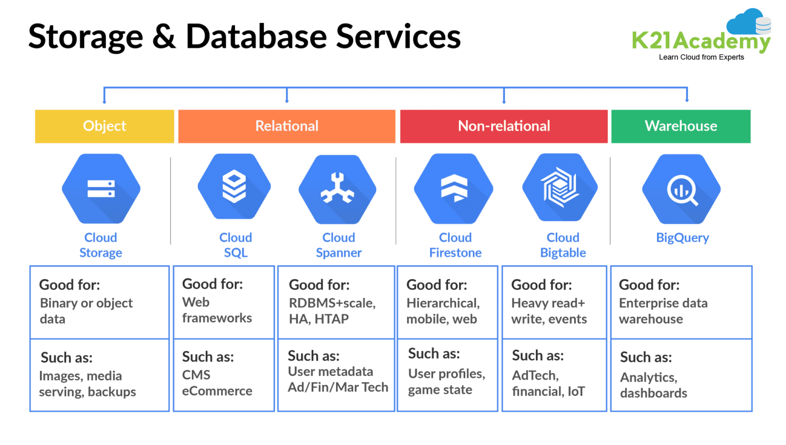
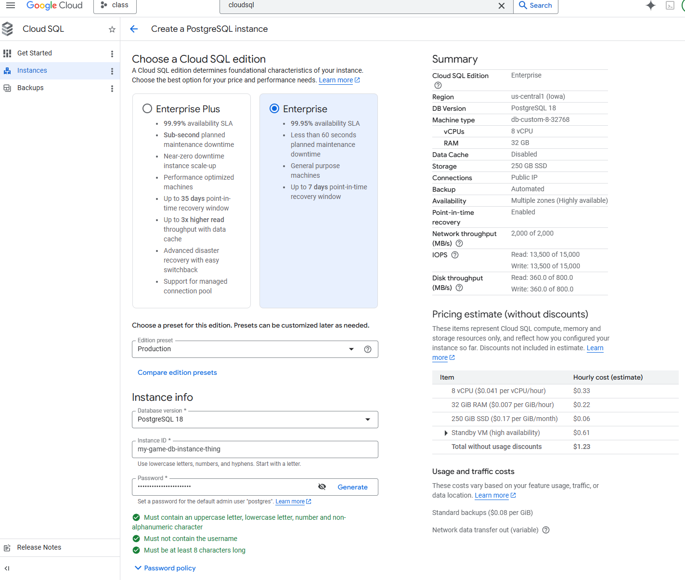
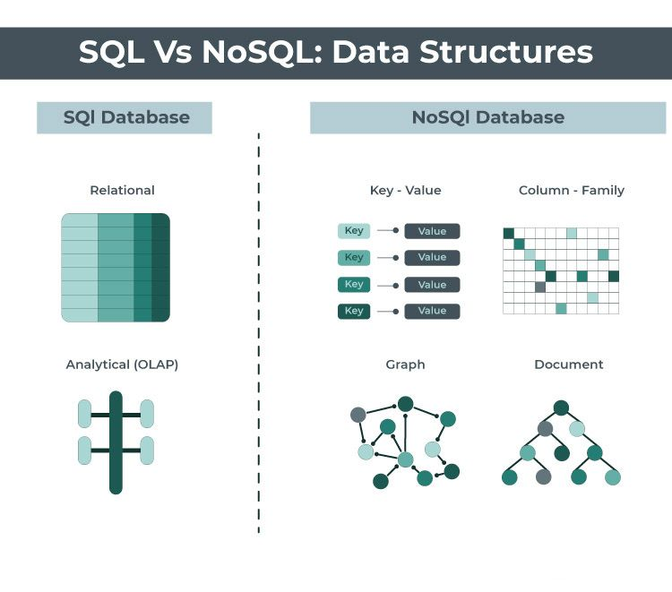

::: {.callout-note collapse="false"}
## readme.txt — Lecture Objectives

-   While we have already dipped our toes into stateful storage (like creating Cloud Storage buckets to trigger our background workers), our primary focus so far has been on the *compute* layer.
-   We have primarily focused on stateless applications where, if a container crashes or a VM reboots, anything in its local memory is gone forever.
-   Often, the hardest part of cloud architecture is not running the code; it is safely storing, organizing, and retrieving the data.
-   Today, we are taking a more structured dive into the data layer.
:::

------------------------------------------------------------------------

## Part 1: Unstructured Data (Google Cloud Storage)

-   If you are dealing with files like images, videos, or anything that doesn't neatly fit into a spreadsheet row, you need Object Storage.
-   Cloud Storage (GCS) is an infinitely scalable hard drive in the cloud. You don't format file systems; you just drop objects into "Buckets."
-   **The Scale:** Gigabytes to Exabytes. It scales "infinitely".
-   **Rule of Thumb:** If your code uses standard file open/read/write operations (handling `.csv`, `.png`, or `.mp4` files), it belongs in Cloud Storage.

### The Storage Classes (Hot vs. Cold Data)

-   In the cloud, not all data is accessed equally.
-   Google offers four different "Storage Classes" based on how frequently you plan to read the data.

::: {.callout-important collapse="false"}
## config.sys — The Cost Trade-off: Storage vs. Retrieval

-   The colder the storage, the cheaper the monthly gigabyte cost.
-   **However, cold storage charges you a "Retrieval Fee" every time you access a file.** If you put a highly trafficked website logo in Archive storage, the retrieval fees will add up quickly.

| Storage Class | Intended Frequency | Monthly Storage Cost | Retrieval Cost |
|:-----------------|:-----------------|:-----------------|:-----------------|
| **Standard** | "Hot" (Accessed frequently / live data) | Highest (~$0.02/GB) | **Free** |
| **Nearline** | Accessed less than once a month | Cheaper | Low Fee |
| **Coldline** | Accessed less than once a quarter | Very Cheap | Medium Fee |
| **Archive** | Accessed less than once a year | Cheapest (~$0.001/GB) | **Highest Fee** |
:::

**A Use Case:** You are building the backend for a new multiplayer game.

-   **Standard:** You use this for player's custom avatars and live guild emblems, because they are loaded by other players every single day.
-   **Archive:** You use this to store the massive 50GB server log files from three years ago. You only need to read these if there is a legal audit or a massive bug investigation, so you want them stored as cheaply as possible.

### The Hidden Costs: Network & Transfer Fees

In cloud architecture, we often say that **"Storage is cheap, but movement is expensive."** The network and access fees are often the "hidden" part of a cloud bill that can easily exceed the actual cost of storing the data itself.

To understand these costs, you have to look at the direction of the data and the boundaries it crosses:

1.  **Ingress (Moving Data IN):** Almost always **Free**. Cloud providers want to make it as easy as possible for you to bring your data into their ecosystem.
2.  **Egress to the Internet:** This is the most expensive. If your app serves images from a bucket to users' browsers, you pay for every gigabyte sent over the open web.
3.  **Inter-Region Egress:** Moving data from a bucket in `us-west1` (Oregon) to a server in `us-east1` (South Carolina) incurs cross-country network fees.
4.  **Intra-Region Egress:** Moving data between different zones in the *same* region (e.g., `us-west1-a` to `us-west1-b`) usually has a much lower cost or is completely free.

::: {.callout-warning collapse="false"}
## budget.exe — Beware the "Viral App" Trap
Imagine you host a funny 10MB video in a Standard Cloud Storage bucket. Storing that file costs you less than a penny a month. 
However, if your app goes viral and 1 million people download that video, you are suddenly paying for **10,000 GB of Internet Egress**. What looked like a cheap storage solution just generated a massive network bill!
:::

::: {.callout-note collapse="false"}
## security.sys — What is a Service Account?

Throughout this course, you will hear the term **Service Account**.

-   Think of it like an **ID Badge for a Robot**.
-   Humans use usernames and passwords to prove who they are. Code cannot type in a password. Instead, when you spin up a Cloud Run container or App Engine service, Google assigns that compute instance a Service Account (a robotic ID badge).
-   When your Python code tries to read a file from Cloud Storage, Google checks the instance's ID badge to see if you granted it the correct permissions.
:::

{fig-align="center"}

:::::::::::::: {.callout-tip collapse="false"}
## demo_storage.sh — Full-Fledged Cloud Storage Demo

Let's look at how we provision buckets, assign storage classes, and handle permissions.

**1. Provisioning and Uploading via CLI:**

::: panel-tabset
## Mac / Linux / Cloud Shell

``` bash
# Create a standard regional bucket for live game assets
gcloud storage buckets create gs://[YOUR-PROJECT]-player-media --location=us-west1

# Create an ARCHIVE bucket for old game logs
gcloud storage buckets create gs://[YOUR-PROJECT]-old-logs \
    --location=us-west1 \
    --default-storage-class=ARCHIVE

# Upload a player's custom avatar directly from your local terminal
gcloud storage cp /local/path/to/wizard.jpg gs://[YOUR-PROJECT]-player-media/
```

## Windows (PowerShell)

``` powershell
# Create a standard regional bucket for live game assets
gcloud storage buckets create gs://[YOUR-PROJECT]-player-media --location=us-west1

# Create an ARCHIVE bucket for old game logs
gcloud storage buckets create gs://[YOUR-PROJECT]-old-logs `
    --location=us-west1 `
    --default-storage-class=ARCHIVE

# Upload a player's custom avatar directly from your local terminal
gcloud storage cp /local/path/to/wizard.jpg gs://[YOUR-PROJECT]-player-media/
```
:::

**2. Handling Permissions (IAM):**

-   By default, buckets are entirely private.
-   **The "Public" Way (Basic):** You can grant `allUsers` the `objectViewer` role. This makes every file in the bucket accessible to the entire internet.
-   **The "Signed URL" Way** You keep the bucket private. No one can see the files except your App Engine code (using its Service Account badge). Your code then generates a temporary "VIP pass" (Signed URL) for the user's browser.

::: panel-tabset
## Mac / Linux / Cloud Shell

``` bash
# Ensure the bucket is private (No allUsers binding)
gcloud storage buckets remove-iam-policy-binding gs://[YOUR-PROJECT]-player-media \
    --member="allUsers" \
    --role="roles/storage.objectViewer"
```

## Windows (PowerShell)

``` powershell
# Ensure the bucket is private (No allUsers binding)
gcloud storage buckets remove-iam-policy-binding gs://[YOUR-PROJECT]-player-media `
    --member="allUsers" `
    --role="roles/storage.objectViewer"
```
:::
::::::::::::::

------------------------------------------------------------------------

## Part 2: Structured Relational Data (Cloud SQL & Spanner)

When your data is highly structured, strictly typed, and requires complex relationships (e.g., Users, Roles, Permissions, Transactions), you need a Relational Database (RDBMS).

### Option A: Cloud SQL (The Standard)

Cloud SQL is Google's managed service for MySQL, PostgreSQL, and SQL Server. Google handles the backups, the software patching, and the hard drive provisioning automatically.

-   **The Scale:** Up to 64TB of data per instance. Handles standard web traffic perfectly.
-   **The Cost:** **WARNING.** Cloud SQL is *provisioned*, not serverless. A basic 1-CPU instance costs about **$10 to $15 per month** and bills you 24/7 even if no one is using it.
-   **Rule of Thumb:** Use this when you have strict data integrity needs and your schema is well-defined. If a player is buying an item with premium currency, you *need* the strict ACID compliance of SQL so they can't double-spend their gold!

::: {.callout-note collapse="false"}
## gui.exe — The Web Console vs. The CLI

-   While we emphasize using the command line (`gcloud`) in this course so you can automate your deployments, **provisioning a relational database is often safer in the Google Cloud Web Console.**
-   Why? Cloud providers constantly roll out new database engines and server tiers. If you try to use the CLI to pair a brand-new database engine with an older, cheaper CPU tier (like the shared-core `db-f1-micro`), the command may fail or default to an expensive edition.
-   The Web UI acts as a safeguard. It visually grays out incompatible options and shows you a **live monthly cost estimate**. 

:::



::::: {.callout-tip collapse="false"}
## demo_db.sh — The Cloud SQL Walkthrough

Let's actually spin up a PostgreSQL database and create a schema.

> Note: I highly recommend running this in the Google Cloud Shell built into the web browser, as it comes pre-configured with the correct network authorizations to connect to Cloud SQL.

**1. Provision the Database Server (This takes about 5 minutes)**

::: panel-tabset
## Mac / Linux / Cloud Shell

``` bash
gcloud sql instances create game-db-instance \
    --database-version=POSTGRES_15 \
    --tier=db-f1-micro \
    --region=us-west1 \
    --root-password="my_super_secret_password"
```

## Windows (PowerShell)

``` powershell
gcloud sql instances create game-db-instance `
    --database-version=POSTGRES_15 `
    --tier=db-f1-micro `
    --region=us-west1 `
    --root-password="my_super_secret_password"
```
:::

**1.5 Create the Application Database**
Before we can store game data, we need to create a specific database "bucket" inside the server.

::: panel-tabset
## Mac / Linux / Cloud Shell
``` bash
gcloud sql databases create game_db --instance=game-db-instance
```

## Windows (PowerShell)
``` powershell
gcloud sql databases create game_db --instance=game-db-instance
```
:::

**2. Connect to the Specific Database**
Notice we use the `--database=game_db` flag here! This ensures our tables are built in the right place.

::: panel-tabset
## Mac / Linux / Cloud Shell

``` bash
gcloud sql connect game-db-instance --user=postgres --database=game_db
```

## Windows (PowerShell)

``` powershell
gcloud sql connect game-db-instance --user=postgres --database=game_db
```
:::

*(You will be prompted to enter a password. Once connected, your terminal prompt will change to `game_db=>`, meaning you are speaking directly to our new database!)*

**3. Define the Schema, Insert Data, and Query (Live SQL)**

``` sql
-- Create a strict relational table for the player economy
CREATE TABLE player_bank (
    account_id SERIAL PRIMARY KEY,
    username VARCHAR(50) UNIQUE NOT NULL,
    gold_balance INT NOT NULL DEFAULT 0
);

-- Insert our players into the table
INSERT INTO player_bank (username, gold_balance) 
VALUES ('LeeroyJenkins', 100), 
       ('GamerXYZ', 5000);

-- Run a query to retrieve the rich players!
SELECT * FROM player_bank WHERE gold_balance > 1000;
```

*(Type `\q` to exit the database and return to your bash terminal).*
:::::

### Option B: Cloud Spanner (The Enterprise Behemoth)

Cloud SQL has a physical limit: it mostly lives on one machine in one region. **Cloud Spanner** is Google's proprietary, globally distributed relational database.

-   **The Scale:** Petabytes of data. Millions of queries per second across the globe.
-   **The Cost:** Starting at $\approx$ **$700 per month**.
-   **Rule of Thumb:** You will likely never use Spanner for a class project. It is designed for massive global enterprises (think global banking, or a game like *Destiny 2* tracking millions of player inventories worldwide).

------------------------------------------------------------------------

## Part 3: NoSQL Document Stores (Firestore)

-   Relational databases are rigid; if you want to add a new column for just one user, you have to alter the entire table schema.
-   NoSQL Document Stores throw out the tables and rows, and instead store data as flexible JSON-like documents.



-   **The Scale:** Scales automatically to handle millions of concurrent users.
-   **The Cost:** Serverless billing (Pay per read/write). **Generous Free Tier:** 50,000 free document reads *per day*.
-   **Rule of Thumb:** This is a good choice choice for student projects. If you are building a flexible web or mobile app, use Firestore.

**The Use Case:**

-   Suppose you need a database for player profiles and active buffs.
-   One player might have a JSON document containing their active quests and a "Poisoned" status effect.
-   Another player might have a pet dragon with its own unique stats attached to their document.
-   Because the shape of this data constantly changes based on gameplay, Firestore is perfect.

**Best Practice: Environment Isolation**
Instead of using the hidden `(default)` database, we will explicitly create a named database (`player-data`). This allows you to separate projects, avoid legacy configuration traps, and clearly isolate your application data.

::: panel-tabset
## Mac / Linux / Cloud Shell

``` bash
# Initialize a specific, named serverless Firestore database
gcloud firestore databases create --database="player-data" --location=nam5 --type=firestore-native
```

## Windows (PowerShell)

``` powershell
# Initialize a specific, named serverless Firestore database
gcloud firestore databases create --database="player-data" --location=nam5 --type=firestore-native
```
:::

------------------------------------------------------------------------

## Part 4: High-Throughput NoSQL (Bigtable)

- If Firestore is a filing cabinet for flexible documents, Bigtable is an industrial conveyor belt. 
- It is a wide-column NoSQL database designed for one thing: writing massive amounts of data with extremely low latency.
-   **The Scale:** Millions of read/writes per *second*.
-   **The Cost:** Extremely high. Minimum $\approx$ **$500 per month**. Do not turn this on for a class project!
-   **Rule of Thumb:** Use Bigtable for time-series data, IoT, or heavy telemetry.

------------------------------------------------------------------------

## Part 5: The Decision Matrix & Architecture Checklist

When you draft your architecture for the final project, use this decision tree to pick your data layer, and keep the cost realities in mind!

::: {.callout-tip collapse="false"}
## decisions.csv — Deciding Between Services

| The Need | The GCP Service | Budget Warning |
|:-----------------------|:-----------------------|:-----------------------|
| **I have files (Avatars, Videos, Assets)** | Cloud Storage | Extremely Cheap (Pennies) |
| **I need a flexible backend for player profiles** | Firestore (NoSQL) | Serverless (Generous Free Tier) |
| **I need strict tables to track user money** | Cloud SQL | **Bills 24/7 (~$15/mo min)** |
| **I am collecting live telemetry 60 times a second** | Bigtable | **Danger! ($500/mo min)** |
:::

------------------------------------------------------------------------

## Part 6: The Grand Finale Demo (Wiring It All Together on App Engine)

- Let's look at how a single Python backend API can leverage all three of our primary storage systems simultaneously. 
- To avoid overwriting any existing apps you might have running, we are going to deploy this as a **Named Service** called `cloud-data-demo`.

::: {.callout-warning collapse="false"}
## deploy.sys — Troubleshooting "USER_DISABLED"
If you get an error saying `Deploying to stopped apps is not allowed`, it means your App Engine application is disabled. Go to the **App Engine Settings** in the Cloud Console and click **Enable Application** before deploying.
:::

### Step 1: Securing the Database Password

- **NEVER hardcode your database passwords into your code.** Instead, we use **Google Cloud Secret Manager**. 
- To make this whole pipeline work, our App Engine service account needs two specific "ID Badges" (IAM Roles):
  1. `Secret Accessor`: To read the database password.
  2. `Token Creator`: To cryptographically sign the temporary URLs for our private bucket images.

::: panel-tabset
## Mac / Linux / Cloud Shell

``` bash
# 1. Write the password to a temporary file (without newlines)
echo -n "my_super_secret_password" > db_pass.txt

# 2. Create the Secret Vault, save the version, and delete the file
gcloud secrets create game-db-pass --replication-policy="automatic"
gcloud secrets versions add game-db-pass --data-file="db_pass.txt"
rm db_pass.txt

# 3. Enable the IAM Credentials API (Required for Signed URLs)
gcloud services enable iamcredentials.googleapis.com

# 4. Grant the necessary IAM Roles to App Engine
PROJECT_ID=$(gcloud config get-value project)
SA_EMAIL="$PROJECT_ID@appspot.gserviceaccount.com"

gcloud secrets add-iam-policy-binding game-db-pass \
    --member="serviceAccount:$SA_EMAIL" \
    --role="roles/secretmanager.secretAccessor"

gcloud projects add-iam-policy-binding $PROJECT_ID \
    --member="serviceAccount:$SA_EMAIL" \
    --role="roles/iam.serviceAccountTokenCreator"
```

## Windows (PowerShell)

``` powershell
# 1. Write the password to a file (Force UTF-8 and REMOVE hidden newlines/BOM)
$Pass = "my_super_secret_password"
$Bytes = [System.Text.Encoding]::UTF8.GetBytes($Pass)
[System.IO.File]::WriteAllBytes("$(Get-Location)\db_pass.txt", $Bytes)

# 2. Create the Secret Vault, save the version, and delete the file
gcloud secrets create game-db-pass --replication-policy="automatic"
gcloud secrets versions add game-db-pass --data-file="db_pass.txt"
Remove-Item db_pass.txt

# 3. Enable the IAM Credentials API (Required for Signed URLs)
gcloud services enable iamcredentials.googleapis.com

# 4. Grant the necessary IAM Roles to App Engine
$PROJECT_ID = gcloud config get-value project
$SA_EMAIL = "$PROJECT_ID@appspot.gserviceaccount.com"

gcloud secrets add-iam-policy-binding game-db-pass `
    --member="serviceAccount:$SA_EMAIL" `
    --role="roles/secretmanager.secretAccessor"

gcloud projects add-iam-policy-binding $PROJECT_ID `
    --member="serviceAccount:$SA_EMAIL" `
    --role="roles/iam.serviceAccountTokenCreator"
```
:::

### Step 2: The App Engine Configuration

- Create a directory for your app. 
- Notice the `max_instances: 1` line.
— This is a critical safety feature to prevent App Engine from spinning up dozens of servers and eating your student credits.

**`requirements.txt`**

``` text
Flask==3.0.0
psycopg2-binary==2.9.9
google-cloud-storage==2.14.0
google-cloud-firestore==2.14.0
google-cloud-secret-manager==2.16.0
google-auth==2.23.3
requests==2.31.0
```

**`app.yaml`**

``` yaml
runtime: python311
service: cloud-data-demo

# Budget Safety: Limit the number of instances
automatic_scaling:
  max_instances: 1
```

### Step 3: The Multi-Database Game Dashboard

- Create your `main.py` file. This application serves a web interface to list players (SQL), show their flexible stats (Firestore), and generate secure links for their gear (GCS). 

::: {.callout-tip collapse="false"}
## main.py — The Interactive Dashboard

``` python
import psycopg2, os
from flask import Flask, render_template_string, request, redirect, jsonify
from google.cloud import storage, firestore, secretmanager
import google.auth
import google.auth.transport.requests

app = Flask(__name__)
PROJECT_ID = os.environ.get('GOOGLE_CLOUD_PROJECT')

# Securely fetch the DB password from Secret Manager
def get_db_password():
    client = secretmanager.SecretManagerServiceClient()
    name = f"projects/{PROJECT_ID}/secrets/game-db-pass/versions/latest"
    response = client.access_secret_version(request={"name": name})
    return response.payload.data.decode("UTF-8")

# SQL Connection Helper
def get_db_conn():
    return psycopg2.connect(
        host=f"/cloudsql/{PROJECT_ID}:us-west1:game-db-instance",
        database="game_db", user="postgres", password=get_db_password()
    )

@app.route('/')
def index():
    """Route: Show all players from SQL table."""
    conn = get_db_conn()
    cur = conn.cursor()
    cur.execute("SELECT username, gold_balance FROM player_bank ORDER BY gold_balance DESC;")
    players = cur.fetchall()
    cur.close()
    conn.close()
    
    html = """
    <h1>MT Cloud Games: Leaderboard</h1>
    <p><em>(Running on service: cloud-data-demo)</em></p>
    <ul>
    
        <li><strong>{{ name }}</strong>: {{ gold }} Gold 
            [<a href="/player/{{ name }}">View Profile</a>]</li>
    
    </ul>
    <hr>
    <h3>Create New Character</h3>
    <form action="/add_player" method="post">
        <input type="text" name="username" placeholder="Username" required>
        <input type="number" name="gold" placeholder="Starting Gold" required>
        <button type="submit">Initialize in Cloud SQL</button>
    </form>
    """
    return render_template_string(html, players=players)

@app.route('/add_player', methods=['POST'])
def add_player():
    name, gold = request.form['username'], request.form['gold']
    conn = get_db_conn()
    cur = conn.cursor()
    cur.execute("INSERT INTO player_bank (username, gold_balance) VALUES (%s, %s);", (name, gold))
    conn.commit()
    return redirect('/')

@app.route('/player/<username>')
def view_player(username):
    """Route: Show Profile (Firestore) and Signed Gear URL (GCS)."""
    # Explicitly target our named database!
    db = firestore.Client(database="player-data")
    doc = db.collection("player_profiles").document(username).get()
    stats = doc.to_dict() if doc.exists else {"equipped_weapon": "Standard Gear", "stats": {"str": 10}}

    storage_client = storage.Client()
    bucket = storage_client.bucket(f'{PROJECT_ID}-player-media')
    blob = bucket.blob('wizard.jpg') 
    
    # 1. Fetch the temporary App Engine token
    credentials, _ = google.auth.default()
    credentials.refresh(google.auth.transport.requests.Request())
    
    # 2. Generate the URL using the temporary token instead of a private key
    img_url = blob.generate_signed_url(
        version="v4",
        expiration=900,
        service_account_email=credentials.service_account_email or f"{PROJECT_ID}@appspot.gserviceaccount.com",
        access_token=credentials.token
    )

    html = """
    <h1>Player: {{ username }}</h1>
    <p><strong>Equipped:</strong> {{ stats.equipped_weapon }}</p>
    <p><strong>Strength:</strong> {{ stats.stats.str }}</p>
    <br><br>
    <a href="/">Return to Leaderboard</a>
    """
    return render_template_string(html, username=username, stats=stats, img_url=img_url)

if __name__ == '__main__':
    app.run(host='0.0.0.0', port=8080)
```
:::

### Step 4: Deploying and Testing

::: panel-tabset
## Mac / Linux / Cloud Shell
``` bash
gcloud app deploy
```

## Windows (PowerShell)
``` powershell
gcloud app deploy
```
:::

**Finding your URL:** Because this is a named service, your URL will look like: 
`https://cloud-data-demo-dot-[YOUR-PROJECT-ID].uw.r.appspot.com`

------------------------------------------------------------------------

## Part 7: Infrastructure Teardown (Protect Your Credits!)

- As always, if you're experimenting with these commands, make sure to destroy any infrastructure you don't need. 
- Cloud SQL is the primary cost-driver in this lecture. 

### 1. Delete the Cloud SQL Instance
::: panel-tabset
## Mac / Linux / Cloud Shell
``` bash
gcloud sql instances delete game-db-instance --quiet
```

## Windows (PowerShell)
``` powershell
gcloud sql instances delete game-db-instance --quiet
```
:::

### 2. Delete the Firestore Database
::: panel-tabset
## Mac / Linux / Cloud Shell
``` bash
gcloud firestore databases delete player-data --quiet
```

## Windows (PowerShell)
``` powershell
gcloud firestore databases delete player-data --quiet
```
:::

### 3. Delete the App Engine Service
::: panel-tabset
## Mac / Linux / Cloud Shell
``` bash
gcloud app services delete cloud-data-demo --quiet
```

## Windows (PowerShell)
``` powershell
gcloud app services delete cloud-data-demo --quiet
```
:::

### 4. Cleanup Secrets and Storage
::: panel-tabset
## Mac / Linux / Cloud Shell
``` bash
gcloud secrets delete game-db-pass --quiet
gcloud storage buckets delete gs://[YOUR-PROJECT]-player-media
```

## Windows (PowerShell)
``` powershell
gcloud secrets delete game-db-pass --quiet
gcloud storage buckets delete gs://[YOUR-PROJECT]-player-media
```
:::