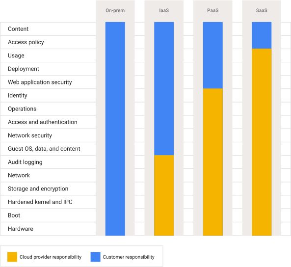

::: {.callout-note collapse="false"}
## readme.txt — Lecture Objectives

-   In the early days of IT, security was a "Castle and Moat." If you were inside the corporate office building or logged into the university VPN, the network trusted you.
-   The cloud does not work this way. The cloud operates on a **Zero-Trust** model. Absolutely no one—and no piece of code—is trusted by default.
-   Today, we are going to explore the Shared Security model, how Google Cloud manages identities across massive organizations, why we use robotic "Service Accounts," and how to easily drop a secure login portal in front of your applications.
:::

------------------------------------------------------------------------

## Part 1: The Shared Security Model

When you deploy an application to an on-premises university server room, you are responsible for the security of the *entire* stack: the locks on the server room door, the encryption of the hard drives, the network firewalls, and the application code.

When you move to Google Cloud, security becomes a **shared responsibility**.

-   **Google's Responsibility (The Lower Layers):** Google handles the physical security of the data centers, the integrity of the underlying hardware network, and the default encryption of data on the physical disks.
-   **Your Responsibility (The Upper Layers):** You are responsible for securing the data itself. You control who (or what) has access to your data, which ports are open to the internet, and the security of your application code.

Google provides the tools (like IAM and Firewalls), but *you* must configure them correctly.

{fig-align="center"}

------------------------------------------------------------------------

## Part 2: Cloud Identity & The Resource Hierarchy

To manage access, we first have to understand how Google Cloud organizes its assets and its users.

### 1. Cloud Identity (Managing the Humans)

When you first start building, it is easy to just invite your teammates' `@gmail.com` accounts to your project. However, this becomes a nightmare for an organization. If an employee leaves, you have to manually track down every project they had access to and remove their Gmail account.

**Cloud Identity** allows organizations to centrally manage users and groups (often tying into existing Active Directory or LDAP systems). If someone leaves the company, an admin disables their Cloud Identity account once, and their access to all cloud resources is instantly revoked.

### 2. The Resource Hierarchy

Permissions in Google Cloud cascade downwards through a strict hierarchy. If you are granted access at a high level, you inherit that access for everything beneath it.

1.  **Organization:** The root node (e.g., `umontana.edu`). *(Note: Personal Gmail users do not have an Organization node, which is why your personal projects start at the Project level!)*
2.  **Folders:** Used to isolate departments (e.g., `Engineering` vs. `HR`).
3.  **Projects:** The core organizing entity where billing is calculated. Every resource must belong to a project.
4.  **Resources:** The individual tools (e.g., a Compute Engine VM or a Cloud Storage Bucket).

------------------------------------------------------------------------

## Part 3: The Core of IAM (Identity and Access Management)

IAM is the system that answers one specific question: **"Who can do what, on which resource?"**

### The "Who" (Identities)

An **identity** can be a Google Account, a Google Group, a Cloud Identity domain, or a service account.

### The "What" (Roles)

A **Permission** is a single, hyper-specific action (e.g., `compute.instances.start`). Because there are thousands of permissions, Google groups them into **Roles**.

There are three types of roles you can assign:

::: {.callout-warning collapse="false"}
## Basic Roles

-   Includes **Owner**, **Editor**, **Viewer**, and **Billing Administrator**.
-   Basic roles are sometimes dangerously broad.
-   An `Editor` on a project can modify almost *any* resource in that project.
-   If several people are working on a project with sensitive data, basic roles are usually too broad.
:::

::: {.callout-tip collapse="false"}
## Predefined Roles (The Standard)

-   Specific Google Cloud services offer sets of predefined roles (e.g., `roles/compute.instanceAdmin`).
-   This allows a user to perform a specific set of actions on specific resources without granting them sweeping project-wide access.
-   This is the recommended approach for most teams.
:::

::: {.callout-note collapse="false"}
## Custom Roles (The Precise Failsafe)

-   If predefined roles are still too broad, you can hand-pick exact permissions to create a Custom Role. This adheres to the principle of least privilege (giving someone *only* the permissions needed for their job).
-   *Caveats:* You must manually manage these permissions as Google updates its services. Also, Custom Roles can only be applied at the Project or Organization level. They cannot be applied to Folders.
:::

### The IAM Matrix: Who gets What, and Where?

To visualize how this plays out in the real world, here is a breakdown of common identities, the roles they are assigned, and the level of the hierarchy where they are applied:

| Hierarchy Level | The "Who" (Identity) | The "What" (Role) | Why it makes sense |
|:---|:---|:---|:---|
| **Organization** | `security-team@umontana.edu` (Google Group) | `Organization Security Admin` | The security team needs to audit firewall rules across the entire university. |
| **Folder** (`Engineering`) | `alice@example.com` (Human) | `Project Creator` | Alice manages the Engineering department and needs to spin up new projects for her team. |
| **Project** (`Alpha`) | `bob@example.com` (Human) | `Compute Viewer` | Bob is a junior dev who needs to see the status of VMs, but shouldn't be allowed to delete them. |
| **Resource** (A specific Bucket) | `app-engine-sa@...` (Service Account) | `Storage Object Creator` | The web app only needs permission to upload photos to this one specific bucket, nowhere else. |

### Translating Theory to the Command Line

Throughout this course, you have run several commands to fix "Permission Denied" errors. Now that you understand the theory, let's deconstruct what you were actually doing.

#### 1. Enabling APIs: The Prerequisite to IAM
Before you can even assign a role for a service (like Secret Manager or IAM Credentials), you usually have to run a command like `gcloud services enable secretmanager.googleapis.com`. But what is this *actually* doing under the hood?

* **Opening the Firewall:** In a Zero-Trust environment, your project doesn't even have permission to *talk* to Google's internal servers. Enabling the API opens a specific network pathway.
* **Creating Google-Managed Service Accounts:** Often, enabling an API automatically creates a hidden, Google-owned Service Account (called a **Service Agent**) inside your project. This gives Google the necessary permissions to perform background tasks on your behalf (like securely encrypting your secrets).
* **Registering with IAM:** It registers the service with your project's IAM controller so you can start assigning roles related to it.
* **Starting the Billing Meter:** It tells Google to start tracking usage for that specific tool.

#### 2. Deconstructing the Policy Binding Command
When your App Engine code crashed trying to read a database password in our previous lecture, you ran a policy binding command. Notice how it perfectly maps to the **Where, Who, and What** of IAM:

```bash
# 1. WHERE (The Resource Level - in this case, the specific secret)
gcloud secrets add-iam-policy-binding game-db-pass \

# 2. WHO (The Identity - our robotic App Engine ID badge)
    --member="serviceAccount:[PROJECT_ID]@appspot.gserviceaccount.com" \
    
# 3. WHAT (The Role - the exact predefined permissions needed)
    --role="roles/secretmanager.secretAccessor"
```

### Interactive IAM Policy Evaluator

Use the controls below to build an IAM policy. Select **Who** gets the access, **Where** in the hierarchy they get it, and **What** role they are granted. Watch how the permissions cascade downwards!

```{ojs}
// 1. Define the IAM Inputs (Who, Where, What)
viewof identity = Inputs.radio(
  ["Alice (Human Developer)", "App-Engine-SA (Robot Identity)"], 
  {label: "1. WHO (Identity):", value: "Alice (Human Developer)"}
)

viewof resourceLevel = Inputs.select(
  ["Engineering Folder (High Level)", "Project Alpha (Mid Level)", "Cloud Storage Bucket (Low Level)", "Compute Engine VM (Low Level)"], 
  {label: "2. WHERE (Hierarchy Level):", value: "Engineering Folder (High Level)"}
)

viewof role = Inputs.select(
  ["None (Default)", "Storage Object Viewer (Predefined)", "Compute Instance Admin (Predefined)", "Project Editor (Basic / Broad)", "Explicit Deny All"], 
  {label: "3. WHAT (Role):", value: "None (Default)"}
)

// 2. The Logic Engine: Calculate inherited access for the Bucket
bucketAccess = {
  if (role === "Explicit Deny All" && ["Engineering Folder (High Level)", "Project Alpha (Mid Level)", "Cloud Storage Bucket (Low Level)"].includes(resourceLevel)) return "Blocked (Explicit Deny)";
  if (role === "None (Default)") return "No Access (Implicit Deny)";
  if (role === "Project Editor (Basic / Broad)" && ["Engineering Folder (High Level)", "Project Alpha (Mid Level)", "Cloud Storage Bucket (Low Level)"].includes(resourceLevel)) return "Read / Write / Delete";
  if (role === "Storage Object Viewer (Predefined)" && ["Engineering Folder (High Level)", "Project Alpha (Mid Level)", "Cloud Storage Bucket (Low Level)"].includes(resourceLevel)) return "Read-Only";
  return "No Access (Role not applicable or applied elsewhere)";
}

// 3. The Logic Engine: Calculate inherited access for the VM
vmAccess = {
  if (role === "Explicit Deny All" && ["Engineering Folder (High Level)", "Project Alpha (Mid Level)", "Compute Engine VM (Low Level)"].includes(resourceLevel)) return "Blocked (Explicit Deny)";
  if (role === "None (Default)") return "No Access (Implicit Deny)";
  if (role === "Project Editor (Basic / Broad)" && ["Engineering Folder (High Level)", "Project Alpha (Mid Level)", "Compute Engine VM (Low Level)"].includes(resourceLevel)) return "Full VM Control";
  if (role === "Compute Instance Admin (Predefined)" && ["Engineering Folder (High Level)", "Project Alpha (Mid Level)", "Compute Engine VM (Low Level)"].includes(resourceLevel)) return "Start / Stop / Modify";
  return "No Access (Role not applicable or applied elsewhere)";
}

// Helper to color-code the output badges
getColor = (access) => access.includes("Blocked") ? "#d32f2f" : access.includes("No Access") ? "#757575" : "#388e3c"

// 4. The UI Output rendered via HTML
html`
<div style="border: 2px solid #1a73e8; border-radius: 8px; padding: 20px; background-color: #f8f9fa; font-family: sans-serif;">
  <h3 style="margin-top: 0; color: #1a73e8;">Effective Permissions Dashboard</h3>
  <p><strong>Scenario:</strong> You assigned the <code>${role.split('(')[0].trim()}</code> role to <strong>${identity.split('(')[0].trim()}</strong> at the <strong>${resourceLevel.split('(')[0].trim()}</strong> level.</p>
  
  <h4>Resulting Access on Downstream Resources:</h4>
  <div style="display: flex; gap: 20px; flex-wrap: wrap;">
    
    <div style="flex: 1; min-width: 200px; padding: 15px; border: 1px solid #ccc; border-radius: 5px; background: white; box-shadow: 0 2px 4px rgba(0,0,0,0.05);">
      <h5 style="margin-top: 0; font-size: 1.1em;">🪣 Cloud Storage Bucket</h5>
      <span style="color: white; padding: 6px 12px; border-radius: 20px; font-weight: 600; font-size: 0.9em; background-color: ${getColor(bucketAccess)}; display: inline-block;">
        ${bucketAccess}
      </span>
    </div>
    
    <div style="flex: 1; min-width: 200px; padding: 15px; border: 1px solid #ccc; border-radius: 5px; background: white; box-shadow: 0 2px 4px rgba(0,0,0,0.05);">
      <h5 style="margin-top: 0; font-size: 1.1em;">💻 Compute Engine VM</h5>
      <span style="color: white; padding: 6px 12px; border-radius: 20px; font-weight: 600; font-size: 0.9em; background-color: ${getColor(vmAccess)}; display: inline-block;">
        ${vmAccess}
      </span>
    </div>
    
  </div>
  
  <div style="margin-top: 20px; padding-top: 15px; border-top: 1px solid #e0e0e0; font-size: 0.9em; color: #555;">
    <strong>💡 Key Takeaways:</strong>
    <ul style="margin-bottom: 0; padding-left: 20px;">
      <li>Roles applied to the <em>Folder</em> or <em>Project</em> cascade down to all resources inside them.</li>
      <li>Predefined roles (like <em>Storage Object Viewer</em>) are safe—they grant access to buckets, but completely ignore VMs.</li>
      <li>Basic roles (like <em>Project Editor</em>) are dangerous—they grant full access to <strong>everything</strong>.</li>
    </ul>
  </div>
</div>
`
```

------------------------------------------------------------------------

## Part 4: Service Accounts Deep Dive

We know that **Service Accounts** are "ID Badges for Robots" (they use cryptographic keys instead of passwords so that VMs and App Engine code can authenticate to other services).

However, there is a mind-bending concept you must understand: **A Service Account is both an Identity AND a Resource.**

-   **As an Identity:** A Service Account can be granted the `Instance Admin` role, allowing your App Engine code to spin up new VMs.
-   **As a Resource:** Because it is a resource, it has its own IAM policies! This means Alice can be granted the `Editor` role *on the Service Account*, allowing her to manage its cryptographic keys, while Bob is granted the `Viewer` role *on the Service Account*, allowing him only to see that it exists.

------------------------------------------------------------------------

## Part 5: AuthN vs. AuthZ & Identity-Aware Proxy

It is critical to separate these two concepts: 

* **Authentication (AuthN):** Proving *who* you are (e.g., logging in with a password). 
* **Authorization (AuthZ):** Proving *what you are allowed to do* (e.g., IAM checking if you have the Viewer role).

### Identity-Aware Proxy (IAP)

In the past, to secure an internal company application, you would use a VPN (Virtual Private Network).

- **Identity-Aware Proxy (IAP)** allows you to establish a central authorization layer without a VPN. 
- It acts as a TLS proxy between the outside world and your internal service. 
- When a user tries to visit your app, IAP intercepts them, forces them to authenticate (AuthN) via Google, and then checks IAM to verify they are authorized (AuthZ) to access the application.

::: {.callout-important collapse="false"}
## IAP Limitations

IAP only secures HTTP/HTTPS requests coming from the outside. It **does not** protect against: 

1. Someone using SSH to directly access the VM. 
2. Activities *within* the local network (e.g., VM-to-VM communication inside your project).
:::

------------------------------------------------------------------------

## Part 6: Securing App Engine with IAP

Let's look at how to take a live App Engine application and lock it down so only authorized users can see it. Notice that we will achieve secure user authentication without altering our Python code. 

### Step 1: Configure the OAuth Consent Screen

Before Google allows you to ask people to log in, you have to configure the screen that tells them what they are logging into.

1.  Navigate to **APIs & Services -\> OAuth consent screen**.
2.  Choose **External** (unless you are using a strictly internal university Workspace account).
3.  Fill out the required app name and support email.
4.  Save and continue through the scopes (leave default).

### Step 2: Turn on Identity-Aware Proxy (IAP)

1.  Navigate to **Security -\> Identity-Aware Proxy**.
2.  You will see a list of your active compute resources, including your App Engine app.
3.  Click the toggle switch next to your App Engine app to turn IAP **ON**.

At this exact moment, if you try to visit your App Engine URL, you will be hit with a Google Login screen. However, even if you log in, you will get an "Access Denied" error. Why? Because we proved *who* we are (AuthN), but we haven't given ourselves permission to enter (AuthZ)!

### Step 3: Granting Access (AuthZ)

We need to tell the IAP proxy to put our specific email address on the authorized access list.

::: panel-tabset
## Mac / Linux / Cloud Shell

``` bash
# Add your personal email to the IAP allowed list for this project
gcloud projects add-iam-policy-binding [YOUR-PROJECT-ID] \
    --member="user:your.email@example.com" \
    --role="roles/iap.httpsResourceAccessor"
```

## Windows (PowerShell)

``` powershell
# Add your personal email to the IAP allowed list for this project
gcloud projects add-iam-policy-binding [YOUR-PROJECT-ID] `
    --member="user:your.email@example.com" `
    --role="roles/iap.httpsResourceAccessor"
```
:::

Now, refresh your App Engine URL. You will log in with your Google account, the proxy will verify your Identity has the `IAP-secured Web App User` role (`roles/iap.httpsResourceAccessor`), and it will let you through to your Python application!