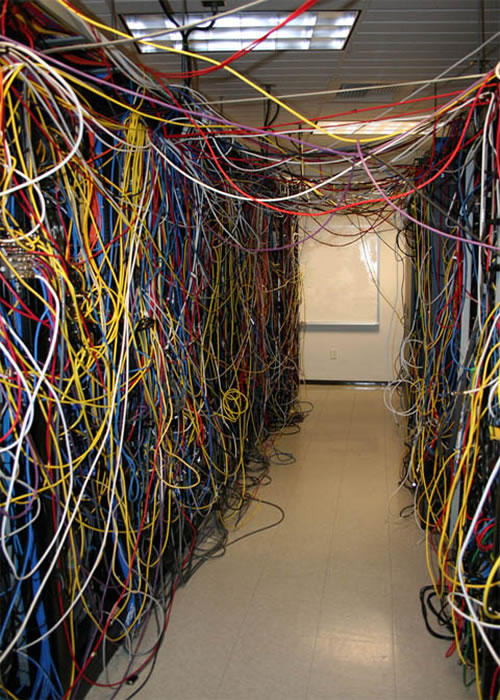
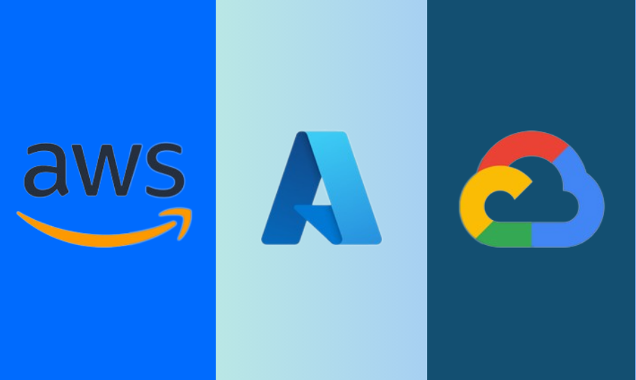

::: {.callout-note collapse="false"}
## readme.txt — End of Semester Recap

Today, we will very briefly recap what we learned this semster, and discuss some broad differences between cloud providers.

1.  Recap the core architectural principles you have mastered this semester.
2.  Examine how the architecture we built maps to the broader industry.
3.  Compare the design philosophies of the "Big Three" cloud providers: AWS, Google Cloud (GCP), and Microsoft Azure.
:::

------------------------------------------------------------------------

## Part 1: What We Built (Semester Recap)

Let's review the fundamental takeaways and shifts in thinking you developed this semester:

### 1. The Cloud Evolution & Shared Responsibility

-   Before the cloud, companies had to buy, rack, and cool their own physical server farms.
-   The modern cloud emerged thanks to massive leaps in **fast networking, virtualization, and containerization**.

::: {.callout-important collapse="false"}
### Takeaway

-   Moving to the cloud is fundamentally about the **Shared Responsibility Model**.
-   A cloud provider manages the physical hardware, hypervisors, and data center security, while you manage the data and application logic.
-   This division of labor and specialization is exactly what enables massive scalability and rapid, agile software development.
:::

::: {.callout-note collapse="false"}
### nightmare.jpg

{fig-align="center"}
:::

### 2. Containerization: The Modern Unit of Compute

-   We saw how containers revolutionized deployment.
-   Instead of manually configuring virtual machines, you learned to package your code, runtime, and all system dependencies into a single, standardized box.

::: {.callout-important collapse="false"}
### Takeaway

-   Containers solve the "it works on my machine" problem.
-   They are incredibly practical because they provide total consistency from your local laptop up to production.
-   They act as the underlying fuel for serverless platforms like Cloud Run, allowing instances to boot in milliseconds and scale out horizontally under load.
:::

### 3. Decoupling & Event-Driven Design

-   We moved away from monolithic web servers that try to do everything at once.
-   By introducing **Pub/Sub (Message Queues)**, we can separate the frontend (user interface) from the backend (heavy computation).

::: {.callout-important collapse="false"}
### Takeaway

-   The way we architect apps in the cloud mimics the way we design software.
-   We separate application deployment into separate logical units that communicate with each other.
:::

::: {.callout-note collapse="false"}
### eda.png - Event Driven Architecture

.](images/event_broker.webp)
:::

### 4. Infrastructure as Code (IaC)

-   Clicking through a web console ("ClickOps") is fine for learning, but it is not how the industry operates.
-   We used **Terraform** to define your buckets, databases, and network topologies in code.

::: {.callout-important collapse="false"}
### Takeaway

-   Your infrastructure is now version-controlled, reproducible, and self-documenting.
-   You can tear down and rebuild an entire enterprise-grade architecture in seconds.
:::

### 5. Zero-Trust Security & Automation

-   We relied heavily on **GitHub Actions** to automatically deploy code.
-   We also applied principles of **Zero-Trust Security** (never trust, always verify, and strictly enforce the principle of least privilege).

::: {.callout-important collapse="false"}
### Takeaway

-   CI/CD deployment pipelines reduce human error, and can automate complex software deployment.
-   The principle of least privilege means and zero trust security make apps more secure, but is hardly foolproof!
-   In real applications, with dollars on the line, security is a vital concern.
:::

------------------------------------------------------------------------

## Part 2: The "Big Three" Cloud Providers

-   You learned cloud engineering using Google Cloud Platform (GCP). However, the architectural patterns you learned (Queues, Blob Storage, Serverless Containers) are universal.
-   If you get a job tomorrow working in AWS or Azure, you already know most of the important components, but the vocabulary is a bit different.

### 1. Amazon Web Services (AWS)

-   **The Philosophy:** "The Everything Store." AWS is the pioneer of cloud computing. They offer a highly granular service for absolutely everything, prioritizing ultimate flexibility and backward compatibility.
-   **The Vibe:** It provides all the raw materials to build a custom engine. The learning curve is steep because developers are required to wire together many low-level networking and security components themselves.
-   **Networking:** Inherently *regional*. If you have servers in Virginia and California that need to talk securely, you must explicitly set up VPC Peering to bridge them.

::: {.callout-note collapse="false"}
### conundrum.jpg - Who do I give my money to?

{fig-align="center"}
:::

### 2. Google Cloud Platform (GCP)

-   **The Philosophy:** "The Developer-First Cloud." Google built its cloud by externalizing the internal tools it used to run Search and YouTube (like Borg, which became Kubernetes).
-   **The Vibe:** It is highly opinionated. It abstracts away a lot of the underlying infrastructure complexity, prioritizing developer velocity, unified interfaces, and data analytics (e.g., BigQuery).
-   **Networking:** Inherently *global*. You can have a subnet in Montreal and a subnet in Tokyo sitting inside the exact same Virtual Private Cloud (VPC), communicating securely over Google's private dark fiber network.

### 3. Microsoft Azure

-   **The Philosophy:** "The Enterprise Hybrid." Microsoft leveraged its absolute dominance in corporate IT to build a cloud that perfectly integrates with existing business infrastructure.
-   **The Vibe:** Seamless integration. If a massive Fortune 500 company or government agency already uses Active Directory for employee logins, Windows Server, and Office 365, Azure allows them to extend that exact same security boundary directly into the cloud.

------------------------------------------------------------------------

## Part 3: The Cloud Rosetta Stone

If you need to rebuild our Capstone architecture on a different provider, here is how the services translate across the industry:

| Architectural Role | Google Cloud (GCP) | Amazon (AWS) | Microsoft Azure |
|:-----------------|:-----------------|:-----------------|:-----------------|
| **Frontend Web Portal** | App Engine | Elastic Beanstalk | Azure App Service |
| **Stateless AI Worker** | Cloud Run | App Runner / Fargate | Azure Container Apps |
| **Message Queue** | Pub/Sub | SQS + SNS | Azure Service Bus |
| **NoSQL Database** | Firestore | DynamoDB | Cosmos DB |
| **Blob Storage** | Cloud Storage (GCS) | Amazon S3 | Azure Blob Storage |
| **Infrastructure as Code** | Terraform | Terraform / CloudFormation | Terraform / ARM Templates |

::: {.callout-tip collapse="false"}
## The Takeaway

-   The tools will constantly change. - AWS will release a new service, Google will rename an old one, and Azure will bundle three things together.
-   **Instead of memorizing a specific tool; internalize the architectural pattern.**

> Because you know *why* a message queue sits between a web server and a background worker, you can successfully build this system on any cloud provider in the world.
:::